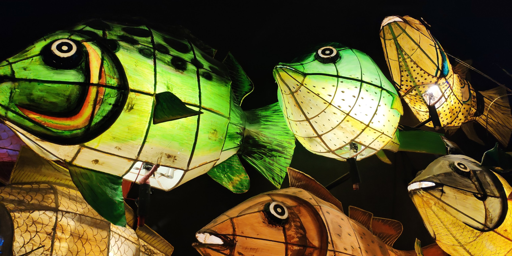

# 深圳博物馆

🎥 小小 vlog 记录 

<iframe src="//player.bilibili.com/player.html?isOutside=true&aid=30833711&bvid=BV1iW411f7ZF&cid=53835977&p=1" scrolling="no" border="0" frameborder="no" framespacing="0" allowfullscreen="true"></iframe>

📍 在市民中心，坐 🚇 11 号线、1 号线或者 4 号线都能到。福田站是真的大，在地下走了好久才找到出口，才看到博物馆。

---

## 🖼️ 展馆感受  
怎么说呢，中规中矩～毕竟深圳历史并不长，重点还是在 **改革开放** 的内容上，看到的很多东西其实都是我童年的记忆，瞬间有点穿越感。  

---

## 🎏 民俗小发现  
深圳的民俗文化里有一个很特别的 **鱼灯** 🐟💡。不过展厅里只是一些老照片，没见到实物，好想亲眼看看呀～  

---

## 🌍 特别展览  
这次还有两个借展：  
- **玛雅文化展** 🗿（疯狂收获表情包 😂）  
- **辽阳白塔展** 🏯 哈哈，这可是我的家乡味道，看到瞬间觉得：真香！  

