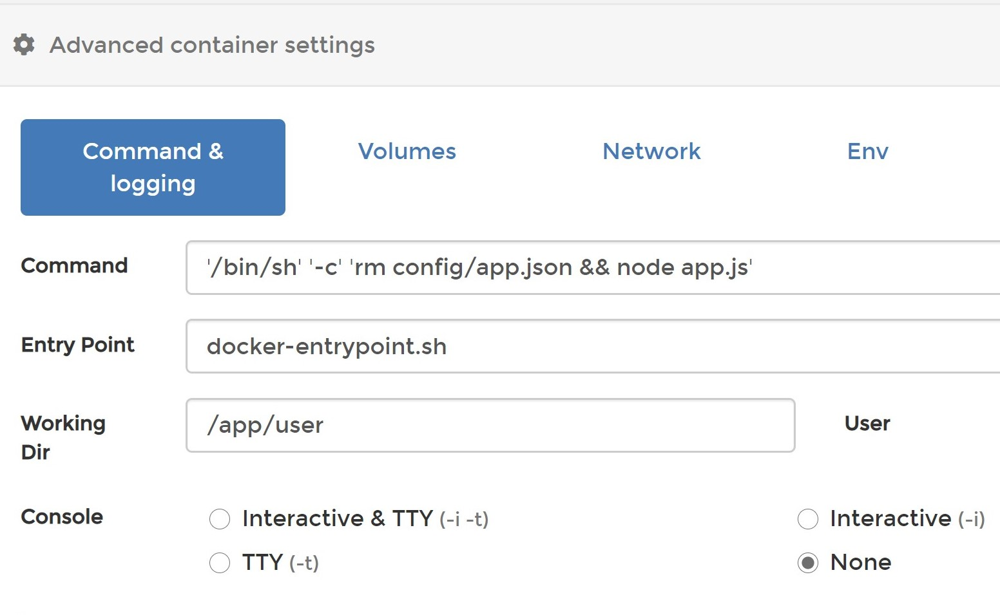

# docker 化的 mongodb 使用方案

之前提到过[使用 watchtower 更新本地的 image 的方案](/tech/2020/03/15/Coding.net使用Jenkins实现自动部署CI&CD)，本来我的系统一直使用 sqlite 来做数据库，现在想改成 mongodb。

涉及到 mongodb 就不得不需要考虑怎么本地化，并且如何做备份。数据本地化很好做，只需要 docker 的 volume 即可，编写`docker-compose.yml`，使用`docker-compose up -d`。

```ini
version: '3.7'

volumes:
  mongo:
  strapi:

services:
  mongo:
    image: mongo
    restart: always
    volumes:
      - mongo:/data/db
    ports:
      - 27017:27017
  adminmongo:
    image: mrvautin/adminmongo
    ports:
      - 1234:1234
    environment:
      - HOST=0.0.0.0
      - CONN_NAME=mongo
      - DB_HOST=mongo
      - DB_PORT=27017
      - PASSWORD=$ADMIN_MONGO_PASSWORD
    links:
      - mongo:mongo
  strapi:
      image: <strapi registry>
      environment:
        DATABASE_CLIENT: mongo
        DATABASE_NAME: strapi
        DATABASE_HOST: mongo
        DATABASE_PORT: 27017
      links:
        - mongo:mongo
      volumes:
        - ./app:/srv/app
      ports:
        - '1337:1337'


```

## 备份

使用如下命令备份

```shell
docker-compose exec -T mongo mongodump --archive --gzip --db <database> > dump.gz
```

## 还原

```shell
docker-compose exec -T mongo mongorestore --archive --gzip < dump.gz
```

## 可视化管理 docker

使用 [portainer](https://www.portainer.io/) 能够可视化管理现在运行的 docker。执行如下命令，再访问 localhost:9000，嗒嗒！以后再也不需要执行`docker ps`了。

```shell
docker run -d -p 8000:8000 -p 9000:9000 --name=portainer --restart=always -v /var/run/docker.sock:/var/run/docker.sock -v portainer_data:/data portainer/portainer
```

## 可视化管理 mongodb

可以使用[adminmongo](https://github.com/mrvautin/adminMongo)提供一套简单可用的 WebUI，我已经写到了 docker compose 里面了。

另外`environment`里面的`PASSWORD`并不好使，已经有[issue](https://github.com/mrvautin/adminMongo/issues/166)，不过已经是 2017 年的了，最快的解决方式就是删除`config/app.json`，只需要在 portainer 里面选择`Containers > mongodb_adminmongo_1` 点击 `Edit`，修改 `Command` 并重新部署。


