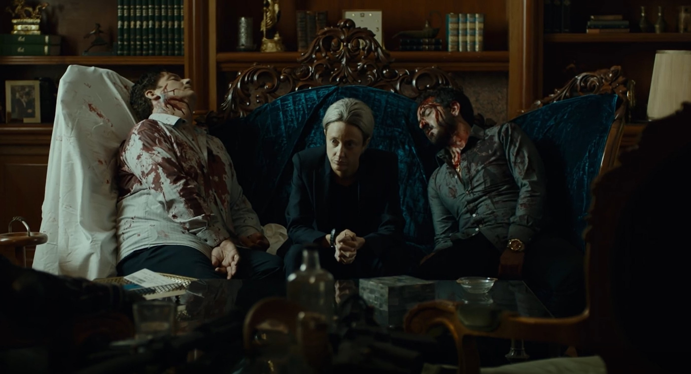

# 亚马逊年度禁毒大戏「零零零」

前几天刷推特，都在传「零零零」这个剧怎么怎么火，说实话，关于黑帮和毒品的剧我还真不敢兴趣，试着抱一抱的心态看了一集，结果一发不可收拾把第一季全看完了，接下来，本文全是剧透！

第一集详细介绍了出场人物，分别是买方（buyer）、中间人（broker）以及卖方（seller）。

买方是一对意大利爷孙，暂时称买方爷爷和买方孙子，买方爷爷正在培养孙子处理生意，而孙子则认为爷爷杀死了父亲而暗自结合朋友猪猪仔准备抢下爷爷的生意并复仇。

中间人是美国的一家人，中间人爸爸带着子女两人（中间人姐姐，Emma 和中间人弟弟）相依为命，Emma 帮着父亲处理家庭生意而因为弟弟遗传了母亲的病，中间人爸爸出于保护不愿意给生意交给儿子，而弟弟却一直想出力。

卖方在墨西哥买通缉毒警察，缉毒警察表面在缉毒，暗地里收了卖方的钱偷偷保护卖方，在一次出警时，虽然已经偷偷通知交易双方，但还是在枪战中杀死了中间人爸爸。

中间人爸爸死后，Emma 哄骗弟弟说爸爸同意他们一起接手生意，弟弟很开心并要求自己亲手接管最新的一批可卡因。然而赶到美国参加追悼会的买家孙子认为姐弟俩太弱小，并且想换到自己的中间人手上来架空爷爷，偷偷买通运货的船长，制造船上事故。

在运输中，船长放火打算把弟弟和船一起烧了，然而在船长逃离后，弟弟成功灭火，并一个人把船开到了非洲。Emma 和弟弟在非洲汇合，为了躲开海关检查，姐弟俩选择了一条穿过圣战分子占领的路前往摩洛哥的卡萨布兰卡，中途险些丧命。

同时，卖方缉毒警察清理了自己部队里面的正义分子，完全黑化后和贩毒者发生金钱上的分歧，逐渐壮大之后，干脆干掉原来的卖方自己收钱。

卖方爷爷得知孙子想复仇，来了一出杀猪儆孙（话说爷爷真的很有人格魅力，不愧是意大利黑帮），坦白自己当年杀儿子的原因。爷爷遭到追杀，孙子假装被爷爷打伤放走爷爷，可是因为演技太差被猪猪仔看出来，猪猪仔挟持孙子妻女，让孙子截下停留在卡萨布兰卡的货。

赶到卡萨布兰卡的买方孙子找到中间人弟弟逼迫他说出货的位置，弟弟故意拖延，成功让货物运出，却因此丧了命。Emma 得知弟弟丧命，到意大利找到买方爷爷，买房爷爷为了保全生意，杀死孙子，并解决掉猪猪仔一帮人。

Emma 来到墨西哥交付尾款，发现卖方已经被缉毒警取而代之，交接下一单的要求后，虽然面带微笑带心怀感伤的离开。而远在意大利，买方爷爷重出江湖处理毒品，并准备培养他的曾孙。

所以，千万不要贩毒 😂。
