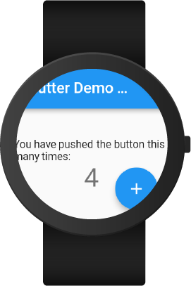

# Flutter 的手表应用-从入门到放弃

这是一个写得一头沮丧的文章，可能是期待值比较高吧，所以任何一个想用 Flutter 写 wearOS 的朋友都要注意一点，他能写，但可能没那么好。这篇文章本来想参考[Flutter: Building Wear OS app](https://medium.com/flutter-community/flutter-building-wearos-app-fedf0f06d1b4)，因为`wear`这个包已经年久失修不支持最新的 SDK（我天，这可是 2019 年 6 月的文章），于是后来参考[Experimenting with Flutter on Wear OS](https://medium.com/@mjohnsullivan/experimenting-with-flutter-on-wear-os-f789d843f2ef)。如果不想踩坑，只是想写个应用截图发朋友圈的话，直接 clone[这个 repo](https://github.com/sbis04/flutter_os_wear)就好，热爱生命，避免折腾，哈哈。

## 可以用 Flutter 来写手表应用吗

答案是可以的，而且还意料之外地能用。首先要在本机安装模拟器（注意不要安装中国版，中国版真的会卡住）。然后直接运行 flutter 的官方示例就可以了。



## 表盘形状

在 Flutter 中可以使用 MediaQuery 获取到屏幕的大小：

```dart
final screenSize = MediaQuery.of(content).size;
final screenHeight = screenSize.height;
final screenWidth = screenSize.width;
```

但是不能获取到表盘的形状，但是可以通过 kotlin 从安卓 Wear OS 的库里面获取。Flutter 为 Dart 提供了一个支持双向传输的数据通道[MethodChannels](https://flutter.io/platform-channels/)，比起 QML，这更像 JS bridge 的实现，因为这些数据是异步传输的，这些数据也可以通过流传输[EventChannels](https://docs.flutter.io/flutter/services/EventChannel-class.html)。

在安卓的 MainActivity 中可以调用如下方法向 Flutter 传递表盘状态，注意因为是 Wear OS，所以在`Android/app/build.gradle`修改`minSdkVersion`为 23，并在以下依赖中增加以下项目。

```gradle
dependencies {
    ...
    implementation 'com.android.support:wear:27.1.1'
    implementation 'com.google.android.support:wearable:2.3.0'
    compileOnly 'com.google.android.wearable:wearable:2.3.0'
    ...
}
```

`AndroidManifest.xml`中打开权限。

```xml
<!-- Required for ambient mode support -->
<uses-permission android:name="android.permission.WAKE_LOCK" />

<!-- Flags the app as a Wear app -->
<uses-feature android:name="android.hardware.type.watch" />

<!-- Flags that the app doesn't require a companion phone app -->
<application>
<meta-data
    android:name="com.google.android.wearable.standalone"
    android:value="true" />
</application>
```

```kotlin
private fun setShapeMethodChannel() {
  MethodChannel(flutterView, shapeChannel).setMethodCallHandler { _, result ->
    setOnApplyWindowInsetsListener(flutterView, {_, insets: WindowInsetsCompat? ->
      if (insets?.isRound == true) {
        result.success(0)
      }
      else {
        result.success(1)
      }
      WindowInsetsCompat(insets)
    })
    requestApplyInsets(flutterView)
  }
}
```

在 Dart 部分通过监听 channel 获得形状

```dart
enum Shape { square, round };
Shape shape;
try {
  final int result = await platform.invokeMethod('shape');
  shape = result == 1 ? Shape.square : Shape.round;
} on PlatformException catch (e) {
  // Default to round
  print('Error detecting shape: $e');
  shape = Shape.round;
}
```

## 省电模式(Ambient mode)

手表耗电是很棘手的，所以安卓手表的应用都会选择支持长期显示时进入省电模式（我就惊了，你说用电子纸多好，偏偏所有人都用 LED，又不是拿手表看片，要那么好的显示搞什么？）。

可以在 kotlin 部分获取省电模式的事件并通过 channel 传给 dart。

```kotlin
class MainActivity: FlutterActivity(), AmbientMode.AmbientCallbackProvider {
    private var mAmbientController: AmbientMode.AmbientController? = null
    override fun onCreate(savedInstanceState: Bundle?) {
        // Set the Flutter ambient callbacks
        mAmbientController = AmbientMode.attachAmbientSupport(this)
    }
    override fun getAmbientCallback(): AmbientMode.AmbientCallback {
        return FlutterAmbientCallback(flutterView)
    }
}

private class FlutterAmbientCallback(val flutterView: FlutterView): AmbientMode.AmbientCallback() {
    override fun onEnterAmbient(ambientDetails: Bundle) {
        MethodChannel(flutterView, ambientChannel).invokeMethod("enter", null)
        super.onEnterAmbient(ambientDetails)
    }
    override fun onExitAmbient() {
        MethodChannel(flutterView, ambientChannel).invokeMethod("exit", null)
        super.onExitAmbient()
    }
    override fun onUpdateAmbient() {
        MethodChannel(flutterView, ambientChannel).invokeMethod("update", null)
        super.onUpdateAmbient()
    }
}
```

在 Dart 部分处理事件。

```dart
@override
initState() {
    super.initState();
    platformAmbient.setMethodCallHandler((call) {
        switch (call.method) {
            case 'enter':
                setState(() => ambientMode = Mode.ambient);
            break;
        case 'update':
            if (widget.update != null)
                widget.update();
            else
                setState(() => ambientMode = Mode.ambient);
        break;
        case 'exit':
            setState(() => ambientMode = Mode.active);
        break;
    }
  });
}
```

## 总结

Flutter 能写安卓应用吗？能，而且比不好用要强得多。但是如果想写出 apple watch 的应用那种，还是道阻且长。不过考虑 wear OS 本身自己的应用都不咋地，感兴趣玩一下还是可以的。

另外 Flutter 没有为 wearOS 设计 Material 设计语言的部件，所以都要自己设计（虽然屏幕也就 1~2 英寸）。也没有左滑后退的能力，只能在界面增加一个后退按钮，如果用户不小心左滑了，应用就关闭了（尴尬）。
