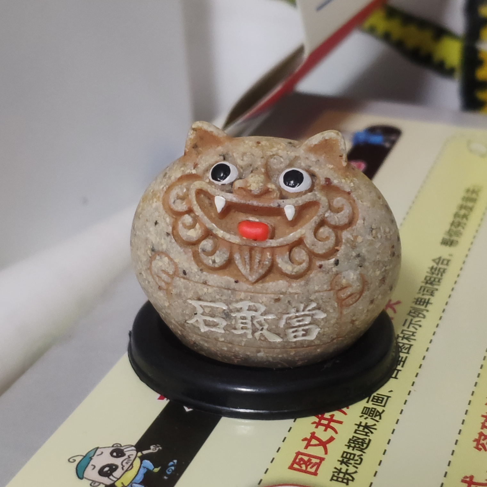

# 降魔的，建国后鬼神都去香港了

去年看过「金宵大厦」后，我就开始关注 TVB 的鬼神片了，最近听说「降魔的 2.0」上映，看了一集没看懂，于是把 2017 年的第一季也看了。这篇文章写在看完 2.0 的第 18 集之后。

「降魔的」主要讲出租司机马季一泡尿解封被封印百年的石精灵「石敢当」，石敢当为报答解封之恩，答应帮马季养母找亲生儿子豪仔的灵魂，不料，在为马季开天眼时能力被马季吸收，马季因此成为降魔人。为了灭掉一个魔，石敢当把自己的全部能量给马季，并和魔同归于尽。第一季结尾，马季终于碰到豪仔的灵魂。

第二季目前讲的是豪仔和海魔做过交易，必须吃人续命，于是找到马季希望能帮忙消灭海魔以解开诅咒。

比较喜欢这部剧环境的设定，比如鬼是人死后为了完成遗愿存在，完成愿望就会去所谓的「目的地」，精灵则是因为被人赋予情感而成形，比如「莉莉」是一个洋娃娃幻化的精灵、「风狮爷」是一个寄予一个爱情故事的石像，魔的存在就更有趣，第一季的大 boss，黑鼠尾草是吸收很多人的血幻化而成，第二季的谎言魔是一幅多年被倒卖的假画幻化而成。

第二季又引入科学解释，搞得这部剧多了些反迷信的色彩（虽然它是鬼片），更加感兴趣它后面的发展了。
