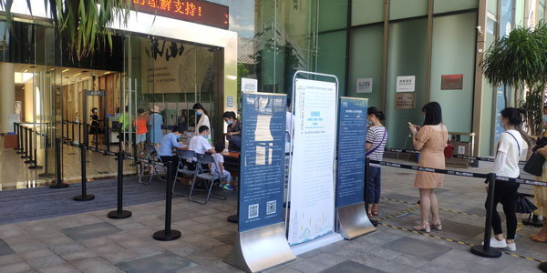
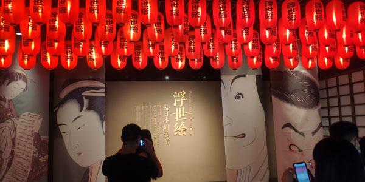
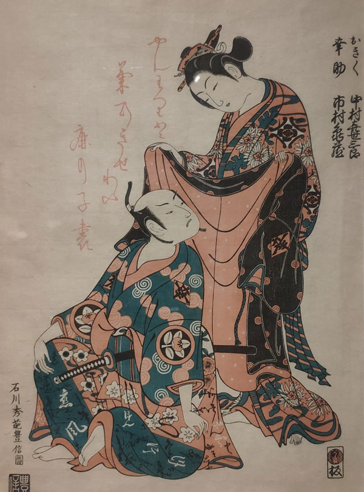
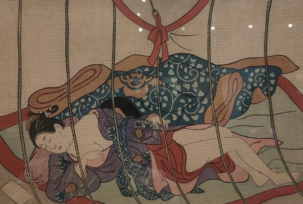
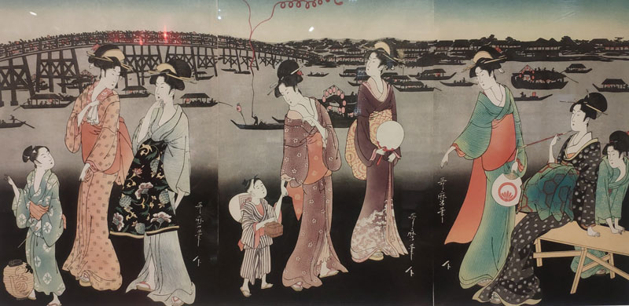
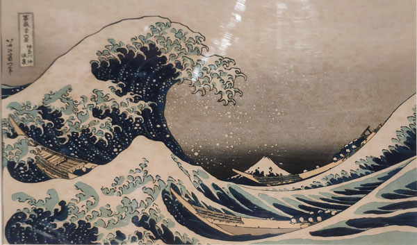
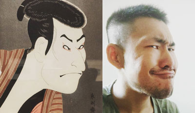

# 南山博物馆浮世绘展览

过去一个月基本上每周都去南山文体中心游泳，常常会路过南山博物馆，因为疫情原因，南山博物馆一直是关闭的，直到我看到了浮世绘的海报，从 6 月份开始南山博物馆开始展览。

因为疫情还在继续，前往南山博物馆需要提前预约并申报健康码。

浮世绘就是源于日本民间的版画，最早是被荷兰人从包装商品的废纸中翻出来，日本人发现竟然有人稀罕这东西，便也拿出来给西方人卖。

## 主题

因为产自民间，浮世绘往往绘画美人、戏曲中的角色、还有春宫图（嘿嘿）。当然，像是风景画什么的也很多见。展览最后说浮世绘影响了西方的印象派绘画，还拿出梵高、莫奈的画来当证据，不过，浙江的博物馆也说水墨画影响了西方印象派...反正都是几百年前的事儿，也没法考证，爱咋咋地吧~

## 六大家

擅长绘制嬉戏女性的铃木春信、绘制已婚妇女生活情景的鸟居清长、偏向中国水墨山水画风的哥川广中、绘制美人肖像画的喜多川歌麿、绘制歌舞剧情景的东洲斋写乐以及以神奈川冲浪里出名的葛饰北斋是浮世绘的六大家。

## 审查制度

和水墨画上面的印章不一样，浮世绘上面的印章主要表示它是被谁审查的，就像现在的版号，可以根据这些印章判断版画的出版时间。
