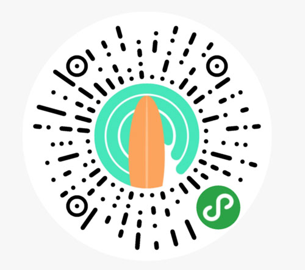

# 在三亚后海学习冲浪

谈到冲浪，其实是国内的一个小众运动（不得不说，国内不管什么运动对比这么大的人口基数都很小众）。大陆的东南沿海都有浪点，尤其是海南岛的东海岸更是冲浪的好地方。

然而有浪点还不足，还需要有租板子的地方，毕竟那家伙一人多高，运起来很不方便。在海南西海岸，接近三亚的地方，海浪常年 1m 左右，很适合初学者学习，另外租金对于清水湾、日月湾来说更便宜。

## 学习冲浪

在后海学习冲浪和租浪板的价格不是很透明，基本上一个店一个价，学习冲浪一节课从 300~600，租用一天冲浪板价格也是从 100~300 不等，所以最好还是货比三家。

往往第一节课的目的是能让你站在板上面，教练在后面推板子，听口令在板子上面蹲下，找到平衡后侧身站起来；第二节课开始教划水，基本上是在板子上做自由泳的动作；第三节，学习怎么抓浪，这一节课教练就不会推你了。

因为家境贫寒，我就学了两节课，好在本身有滑板基础，三节课我两节也能搞定。

另外，感觉课上教的方法虽然普及度很高，但是真的很累啊，首先抓浪起跑，跳到板子上面还要双手划拉，冲完了自己还要推板子回到海里面...其实还有个比较简单的方法，就是走到海水大概没过大腿的位置上，看到浪之后直接起跑，跳到板子上面，不划水直接站起来，这个方法真的要轻松很多。

## 谈谈感受

冲浪真的是一个很上瘾的运动，哪怕无数次试验只有一次成功，那种成就感迸发的肾上腺素就足以让人满足。学习冲浪其实要先查看浪报的，大部分人会上[magicseaweed.com](https://magicseaweed.com/)查看最近是否有好一些的浪，一般将近 1m 的浪对初学者就很合适。

为了方便大家看浪报，我开发了一个踏浪 App 的小程序，直接抓的 magicseaweed 的数据，7 天浪情预报的功能我以后再上。

