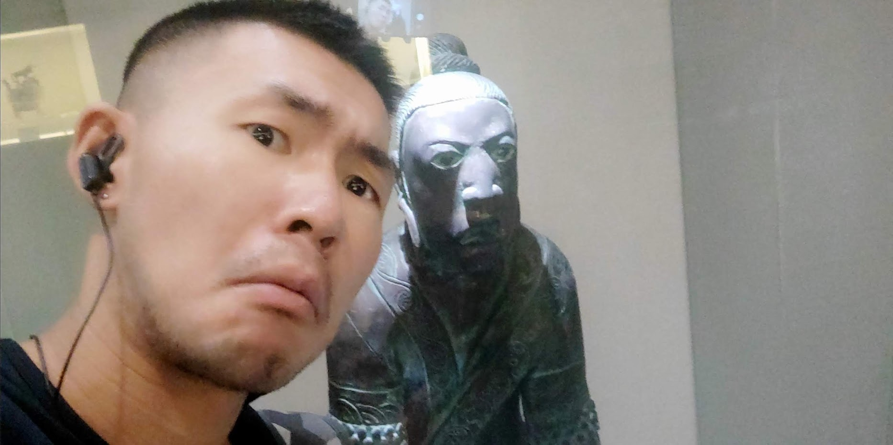
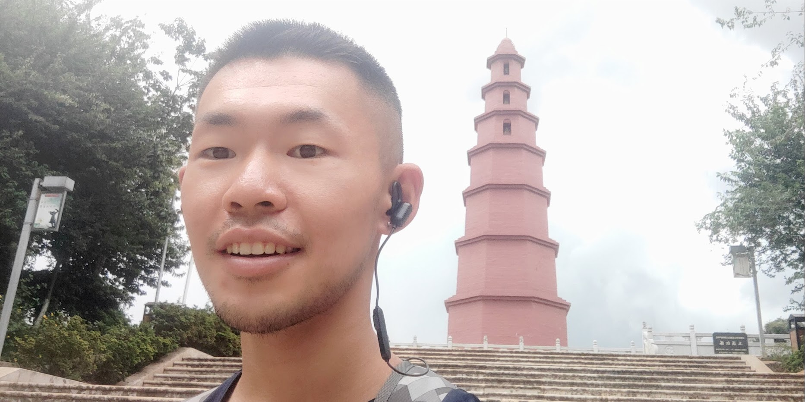
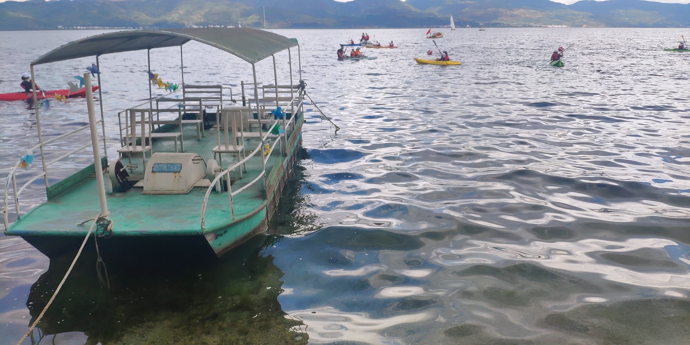

# 玉溪比昆明更加云南 🌿

12 日到 18 日我都在玉溪游玩～不管是物价还是风景，个人感觉，玉溪比昆明更有“云南味”✨。

---

## 🚗 交通小记

- 🚄 高铁  
- 🚌 公交  
- 🛵 共享电动车  
- 🚗 共享汽车  

玉溪就在昆明南边，从昆明南站出发高铁票价只要 **29 元**！而且玉溪站就在市中心，出行很方便。  
如果只在红塔区逛，可以直接办一张共享电动车卡（哈罗、青桔都有）；去江川区可以坐 **50 路公交**，也可以像我一样开个共享汽车环抚仙湖兜风——这次环湖我才花了 **10 块钱**，真香！😆

---

## 🎶 景点推荐

- 聂耳音乐广场 🎻  
- 聂耳公园 🏞️  
- 玉溪市博物馆 🏛️  
- 抚仙湖景区 💧
  - 抚仙湖孤山景区（江川区）  
  - 抚仙湖明星景区（江城县）  
  - 抚仙湖禄充风景区（澄江县）  
  - 月亮湾湿地公园 🌙（澄江县）  
  - 澄江化石博物馆 🦖  

---

## 📝 旅行日志

### 📍 13 日 玉溪博物馆
住在聂耳音乐广场附近，住宿便宜到爆——**42 元一晚**！离健身房（1991 健身）才 1 公里，还能去逛玉溪唯一的沃尔玛（3 公里）。  
聂耳广场是个小提琴造型，湖水清澈，当地人说是为了防止星云湖的水倒灌而蓄水的。  

博物馆里能看到滇国考古内容，不过大部分青铜器都被云南博物馆“截胡”了😂。化石区布置有点恐怖（很多摇头晃脑的恐龙模型），而且就我一个人，气氛太吓人不敢进…🥲  

BTW：在昆明喝到的玛卡酒只能在昆明买到，哭哭 😭。

---

### 📍 14 日 红塔山工厂
红塔山工厂在红塔区，不过地图上一搜全是烟店，导航有点麻烦。工厂里有个市民公园，感觉像深圳南山的荔香公园。公园里有座“红塔”，其实元朝时期是白塔，后来刷了红漆。  

骑车可以直接进去，工厂不进厂房不需要登记，不过满园子的烟味……爱烟人士可能会很享受 😮‍💨。

---

### 📍 15 日 明星鱼洞
交通路线有点复杂，要转三趟车（还只能现金付），一路颠簸才到明星村。  
明星村是真的荒凉 🏚️，吃饭几乎没戏，除非蹭村民的厨房。  

明星鱼洞在村北 1 公里，当地人会在山洞里捕鱼，也是个潜水点（不过考证费很贵💸，所以我没下水）。  

---

### 📍 16 日 澄江县城
从明星鱼洞出来开始下暴雨🌧️，昆明好多航班也被取消。环湖公交一小时才一班，我等了半天只看到一辆。好在路上能随手招客车，10 块钱搞定。  

澄江县城比明星村好太多，起码能吃顿饭🍜。澄江还有个刚开的化石博物馆（8 月新开），不过位置有点坑，要走 2 公里山路。我好不容易走到，人家刚好下班 🙃，只能在门口买个 7 块钱的冰淇淋安慰自己。  

---

### 📍 17 日 回到玉溪市区
第二天继续大雨，好在旅店楼下就有摩范共享汽车🚙。注册流程麻烦到爆，还得人脸识别。  
环湖跑了一圈到聂耳广场才花 10 块钱，价格是真香。但 APP 有 bug：我都锁车了还在计费！🤯 最后还是找客服才解决。

---

## 🎤 总结
玉溪真的比昆明更“云南”🌄。  
昆明明显在对标一线城市，走在街头感觉和北上广差不多；而玉溪节奏慢很多，生活气息浓厚。饭点错过就没饭吃🍲，物价也便宜，甚至健身房都能开在巨大的厂房里。  

总之，如果想体验一个 **更原汁原味的云南**，玉溪绝对值得一去！👍
