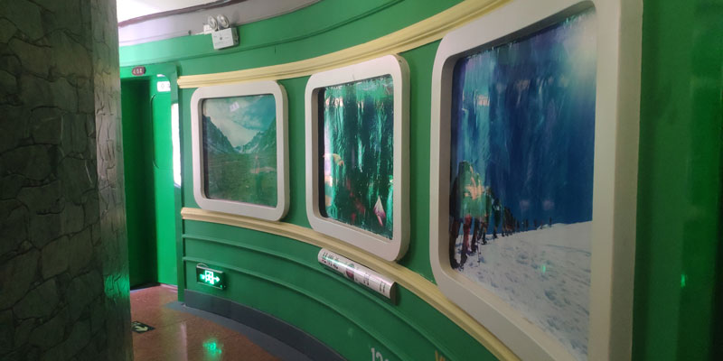
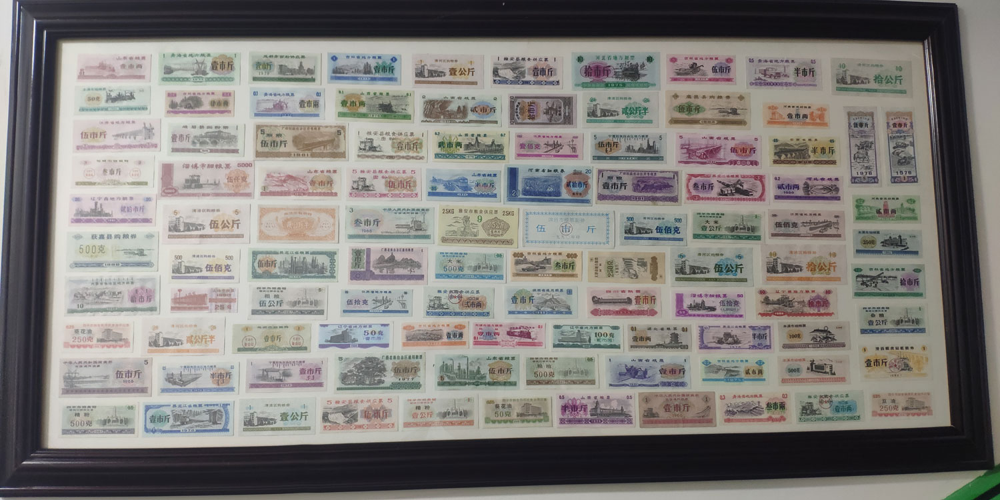
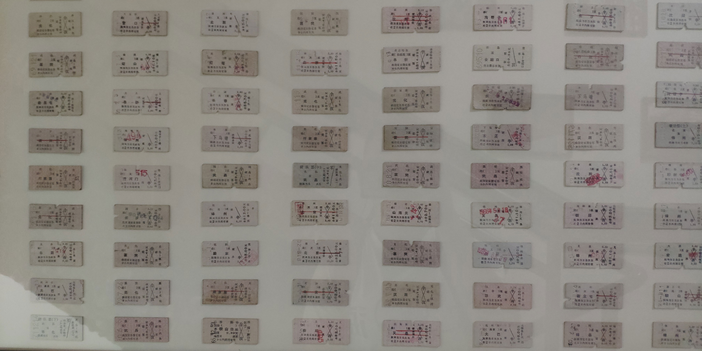
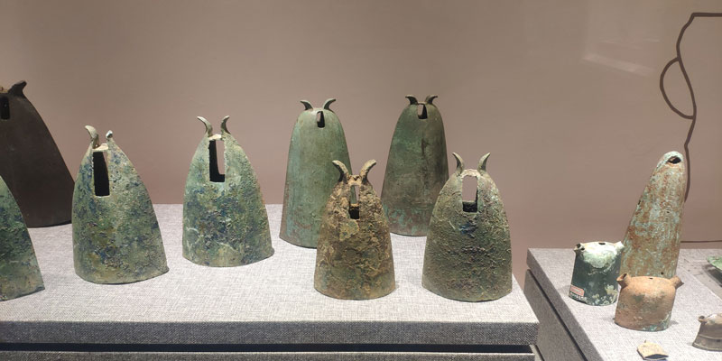
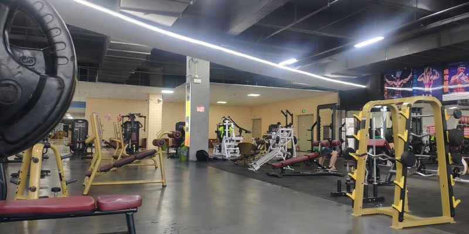

# 暂住在蒙自 

原本打算直接从建水去景洪 🚄，结果无意间刷到蒙自还有个 **红河博物馆** 🏛️。抱着“既然顺路，不如去看看”的心态，就花了 15 块车票钱溜达过来了～

## 滇越驿站 🚂

从火车站坐 **31 路公交** 到州政府下车，就能看到这家超有特色的客栈。房间全是火车车厢的造型，走廊里还挂满了老车票和粮票，活脱脱一个小型博物馆 ✨。

楼下还有食堂～我点了一碗米线 🍜，有意思的是汤、肉和米线是分开打的。不得不说，蒙自的米线真的更合我胃口。不过要选最爱的，还是玉溪的凉米线 😋。

## 红河州博物馆 🦕

展览套路和云南其他博物馆差不多：先是满满的化石、古生物化石 🦴，然后青铜器、法国小火车 🚂。不过大多只是简单陈列，没有太多故事背景。

二楼是少数民族展示 👘，重点是 1950 年代以前的土司制度和民族服饰。但像语言、生活习俗的部分就比较少了，有点小遗憾。

## 蒙自海关档案馆 📜

当年法国占了越南，还和清政府要了邮政权，在蒙自设了海关。靠铁路带动，一度很繁华。后来昆明铁路修好后，这里就逐渐没落了。  
现在只剩临湖的一部分楼开放，可以看到一些旧档案，蛮有历史感 🕰️。

## 康唯国际健身 💪

逛完以后随手喝了一杯「茶颜观色」(山寨茶颜悦色 😂)，然后顺便花 9.9 买了个健身体验卡。  
健身房在中央大街附近，虽然没玉溪的「1991」大，但设备很全，练个大汗淋漓完全没问题 🏋️。

## 总结 ✅

蒙自市区建设得挺不错 👍，到处都有直饮机 💧，城市干净又不贵。  
就是共享单车 🚲 不是大厂牌子，需要押金，还要预充才能骑，稍微有点不方便。  

小贴士：从蒙自火车站出发的公交车是按列车时刻开的，如果错过一趟，那大概率也赶不上火车了 ⚠️。

---
