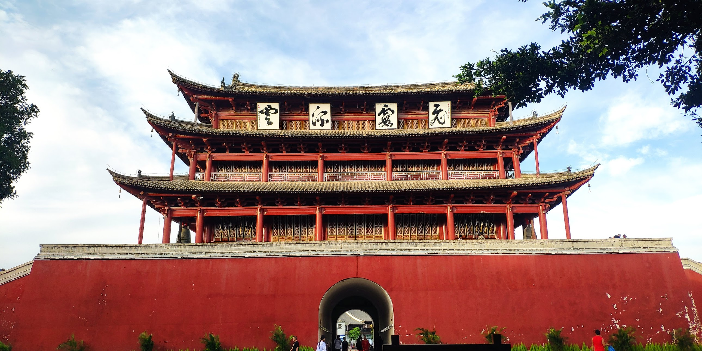

# 滇南最后的江南 —— 建水 🌿

从玉溪坐高铁去建水，只要 **26 块钱** 💸，到达后再搭乘火车站的公交 **2 元** 🚌 就能直达建水古城，性价比满满！

## 倾城湖畔青旅 🏡

我在建水住了两段时间，中间跑去蒙自玩了一圈。最开始没住在古城里，而是在欢乐谷附近的一家青旅。  
倾城青旅是云南这边的小连锁，不论是建水还是昆明，装修都很有特色。阳台外就是一片湖（虽说水不是特别清澈 😅），楼下还能逗店家养的 **龙猫** 🐹，萌翻了！

## 建水文博馆 🏛️

离青旅约 **2 公里**，有一个建水文博馆。进门要登记，但完全值得！馆内收藏了不少建水的木雕、陶器等文物，古韵十足 ✨。

## 建水古城 🏯

后来我搬到古城附近住，不得不感叹：建水物价真的太佛 🤑！超市里的水果拼盘 **1 块钱一包** 🍉🍇。古城里很多景区都是华侨城改建的仿古建筑，看起来很有味道，但我的荷包也有点羞涩了 😅。

## 建水小火车 🚂

古城东门外就是 **临安站**，建水小火车采用 **寸轨**，比标准轨窄得多，据说是为了防止法国侵占，同时也能节约建造成本 🏗️。现在主要是旅游用途，**硬座票 100 元**，略贵，但坐上去还是挺有趣的！

## 总结 🌟

建水绝对是滇南最后的江南了 🌸，华侨城把古城东门改造成了浙东风格的景区。晚上还能吃到全国各地的小吃 🍢🍜，既古色又烟火，旅行体验满分！
