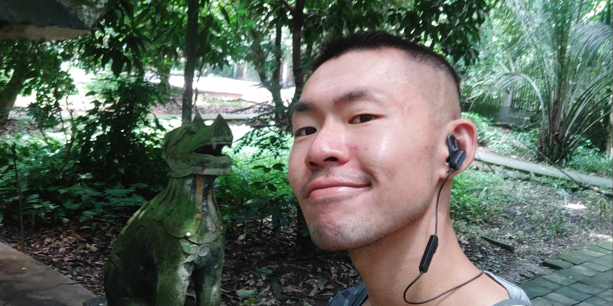
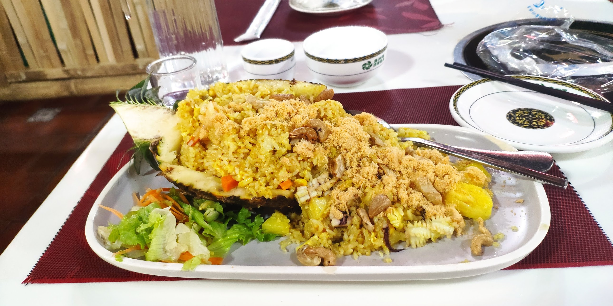

# 在西双版纳必须随时带着识花君  

<iframe src="//player.bilibili.com/player.html?isOutside=true&aid=414987895&bvid=BV13V411y734&cid=244180086&p=1" scrolling="no" border="0" frameborder="no" framespacing="0" allowfullscreen="true"></iframe>

目前去西双版纳，要么✈️飞，要么🚌坐客车。因为我已经在建水，不想走回头路，就选了 **8 小时 230 块** 的客运车。建水到西双版纳每天只有两班：**中午 1 点 & 下午 4 点**。客运站在古城东门 1 公里处，走路就能到。⚠️ 注意：上车地点在门口，如果在候车厅傻等，很可能错过。  

🚗 路上基本全是原始森林，如果遇到晴天，晚上就是一片 **璀璨星空** 🌌。刚到西双版纳本以为扑面而来的是异域风情，结果一出站就是广场舞大妈 + 摩的师傅接人，感觉和很多大陆城市差不多。  

---

## 🌺 曼听花园  

曼听花园曾是古代傣王行宫，门票 20 元。景区里各种热带植物 🌿，必须随身带着 **识花君** 一个个扫着看。  
除此之外，还有傣族表演、鹦鹉表演和大象表演 🐘 —— 说实话，有点像 90 年代动物园的味道。  

---

## 🛕 大佛寺  

就在曼听花园外面，建筑更加恢宏，竟然还是 **免费的** ✨！  
它原本是南传佛寺，文革期间完全损毁，如今的模样是 1989 年重修的。  

---

## 🏮 景洪大佛寺 & 夜市  

澜沧江对岸新建了一个 **景洪大佛寺**，寺庙脚下就是一个巨大的沿江夜市 🌃。  
在这里可以吃到来自老挝、泰国、越南、缅甸的小吃 🍢，很有边境城市的氛围。  

---

## 🍍 总结  

景洪的物价不算低，但住宿很便宜 👍。景区大多是原始森林，几个花园看起来差别不大。  
所以普通游客的重点还是 **吃吃吃**：菠萝饭、芒果饭 🥭、各种热带小吃都很值得尝试！  

