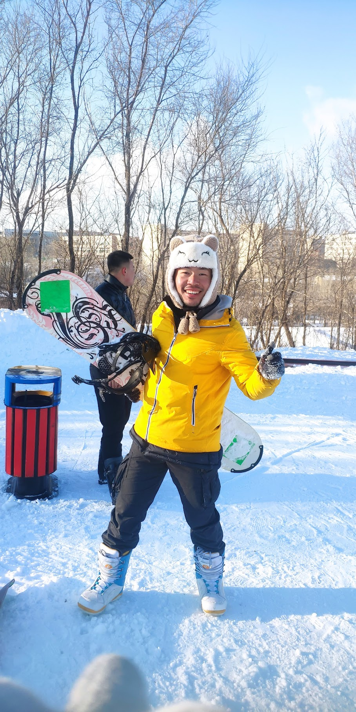

# 在哈尔滨学会了单板滑雪 🏂❄️

从漠河回到哈尔滨，果然没那么冷了🌡️，于是我决定再去滑一次雪。青旅里大家普遍都去亚布力，但我觉得亚布力太竞技，而且还贵💸。如果让我选，我更喜欢伏尔加庄园⛷️——从城堡上滑雪的体验真的超神奇✨。

伏尔加庄园官网已经荒废了，查了一下飞猪还有账号。原来雪场要等到 12 月 16 号才开放📅，我又不能在哈尔滨等那么久。哈尔滨周边还有很多雪场，我在 GoSki 上找到了名都滑雪🏔️，公众号显示「准备开放」。于是我像平时一样，去微博看了一下，果然有人在滑！咨询没回，我就决定亲自去探探路👀。

从哈尔滨火车站到名都滑雪场，可以坐 338 路直达🚌，在哈尔滨职业技术学院下车。疫情期间要绕过学校，滑雪场就在学校后面🏫❄️。

雪票很便宜，只要 59 元，加十元柜子费🪝。中级雪道还在铺设中，所以我就在初级雪道上练习。按照 B 站教学，先推雪、练单刃、再双刃交替，两个小时下来，基本就会了💪。

哈尔滨日落超级快🌇，大概四点就天黑了。考虑到再滑下去会冷，我就短暂告别雪场❄️👋。本来打算坐地铁回去，但正好碰到 338 路，干脆直接坐车回啦🚍。
