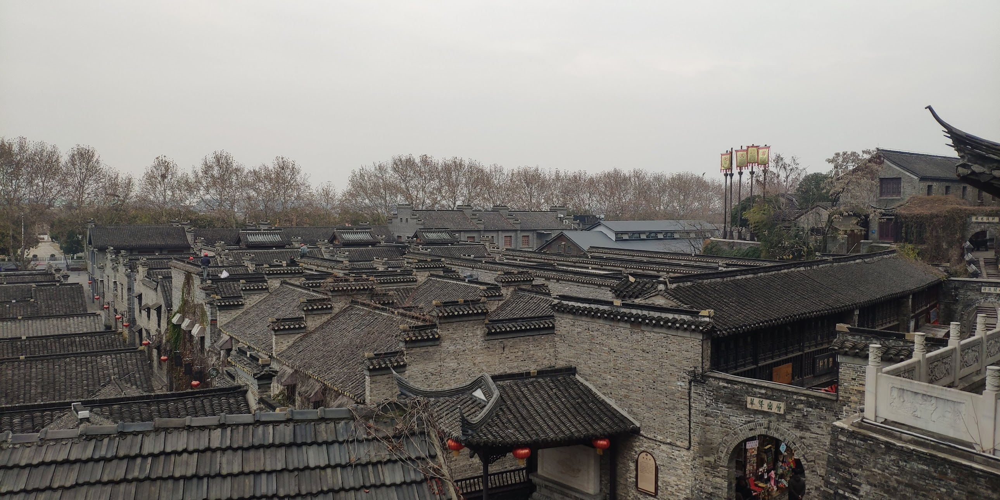

# 在镇江博物馆就不要租讲解器 🎧❌

因为疫情想绕开上海回家，我选了沈阳飞南京，然后再从南京到扬州飞大连✈️。顺便还能逛逛这些城市，真是顺路的小旅行~

镇江市比南京冷清很多❄️，尤其是在江南的冬夜，大街上空空荡荡，小店也门可罗雀🛍️。第一印象就是——南京的“睡都”😴。毕竟南京到镇江的动车不到半小时🚄。

我住在八佰伴商场附近，到镇江博物馆大概 2 公里左右。天气冷，就干脆走过去吧🚶‍♂️。离开八佰伴，高楼渐少，慢慢进入典型的江南小城风情🏘️。

镇江博物馆位于老英国领事馆内，免费开放🏛️。门口有讲解器可以租，但藏品不多，也没有太多镇江历史的讲解内容💁‍♂️，所以个人建议——完全没必要租。  

一楼是青铜器馆和瓷器馆，二楼是书画馆和工艺品馆🎨。二楼还有一半是玻璃穹顶☀️，看上去有点哈利波特里斯普劳特教授花圃的感觉✨。  

博物馆出来就是西津渡景区🏞️。这是三国时期就有的渡口，现在复建成景区，基本上和很多仿古景区差不多😅。有些道路故意挖出明清甚至更早的砖路，像老房子层层覆盖的地板一样，也难怪去渡口要爬楼梯🪜。

这就是镇江的日常了~明天我就打算坐客运去扬州看看啦🚌🌿。
