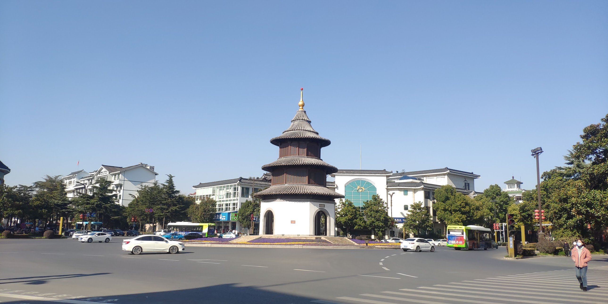

# 扬州，不愧是他👓的城市 🌿🏯

> 本来是为了避开浦东疫情绕道南京从扬州回大连，但既然大连也爆发疫情，只好硬着头皮来了😂

从镇江到扬州，可以直接坐客运🚌，比城际列车便宜，也不绕路。镇江和扬州分别在长江南北两岸，阳光直射的扬州虽然温度一样，但体感绝对比镇江暖和☀️。

## 扬州双博物馆 🏛️

从客运站坐公交就能到扬州双博物馆。所谓“双博物馆”，其实就是扬州博物馆 + 雕版印刷博物馆。扬州博物馆内容比镇江博物馆丰富很多👍。雕版印刷博物馆更像是扬州博物馆的一个分厅，不过因为扬州至今还保留着雕版印刷，所以才单独成立。  

有趣的是，扬州早年曾是沿海城市🌊，北靠黄河出海口、南连长江出海口，可算是个升级版的上海😎。可大自然太会玩，硬生生把这个沿海城市变成了内陆城市。

## 东关街 🍜

东关街几乎是每个古城的标配小吃街，各种扬州特色美食和园林都在这里。扬州曾是沿海城市，以产盐为主，盐商们又没法从官，多出来的钱就用来建园子🏡。  

和苏杭的园林不同，那些园子大多是养老休闲用的，而扬州的园子则豪气又有钱气✨。比如著名的个园就在东关街，但我只是门口看看，没有进去😅。

## 瘦西湖 🌊

瘦西湖一定要去！有人冬天不推荐我去，但我还是去了❄️。虽然冬景比不上盛夏，但作为扬州的代表性景区，刚进景区就能看到青砖白瓦、杨柳依依🍃，不自觉地放慢了脚步。大概这就是古代扬州土豪的闲情雅致吧~💫
