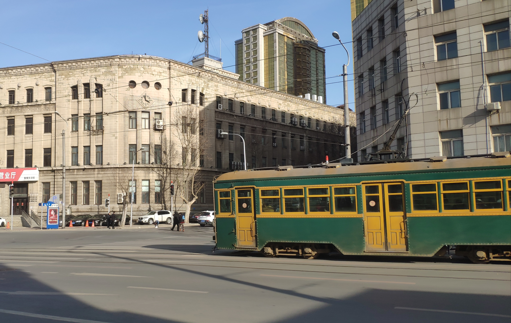
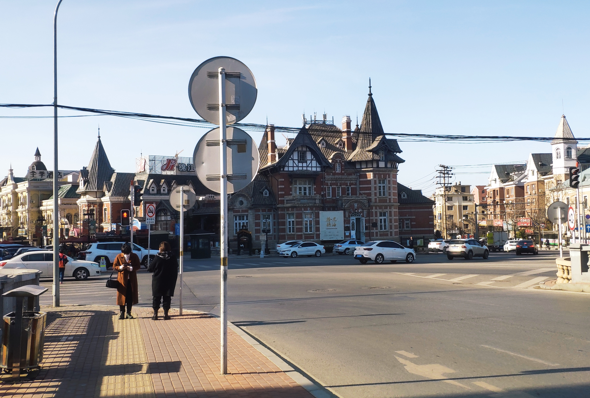

# 大连美术馆

上个月简单地去了趟大连自然博物馆，这回去一趟真正的市中心看看大连美术馆，顺便看看自然博物馆的旧址，建于 1902 年的大连美术馆，连同它所在的一条街都是沙俄所建的技工路（想想这条路留下来了，或许和它工人阶级的性质脱不开关系），现在改为俄罗斯一条街，专卖套娃望远镜等一些小商品。

即使在一百年前这里是个交通要道，但如今却没那么方便，距离美术馆的最近的地铁站友好广场也要一公里左右，不过路上风景也不错，那些俄式的楼加上经过的电车，昭和风扑面而来。

不知道是不是为了修旧如旧，不管是在用的美术馆还是已经废弃的自然博物馆都是一片破败景象，尤其是美术馆，和旁边的旅店比起来完全不像同时代建筑

