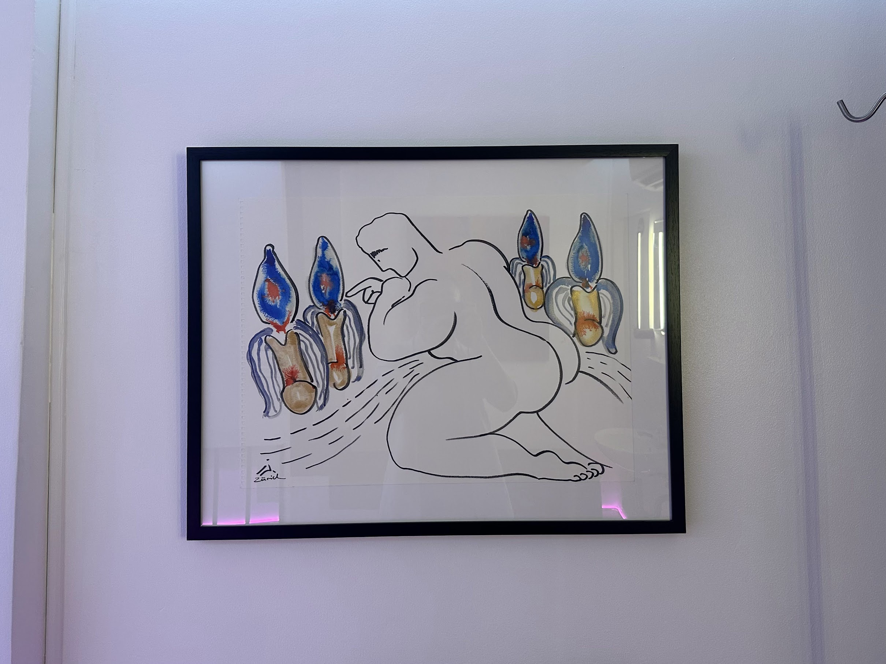

# Week 52: Did an HIV Test 🩺

This week I was living in **Hua Lamphong, Bangkok** 🌆.  
Sometimes I wandered over to **Lumpini Park** near Silom 🏞️. After some research, I realized **Silom is a red-light area** 🔴.  

Fun fact: If I buy 6 bottles of **TENO-EM** (for PrEP), I could get an **HIV test for free** — normally costs 8,900 BHT 💸. Figured it’s better to just try it once.  

The clinic is called **PULSE Clinic**, right under the **Sala Daeng BTS bridge** 🚉. The front looks a bit… kinky 😅.  
The test? Just a little blood draw. After **20 minutes**, I got my results ✅.

---

## Outdoor Gyms 💪

Bangkok has **tons of outdoor gyms**!  
Lumpini Park has one too — only **30 BHT a day**. Perfect for keeping active without breaking the bank.

---

## Next Week 🔮

Next week is the **last week of 2023**!  
If I’m lucky, I might finally **find a condo** that fits me 🏢✨.
