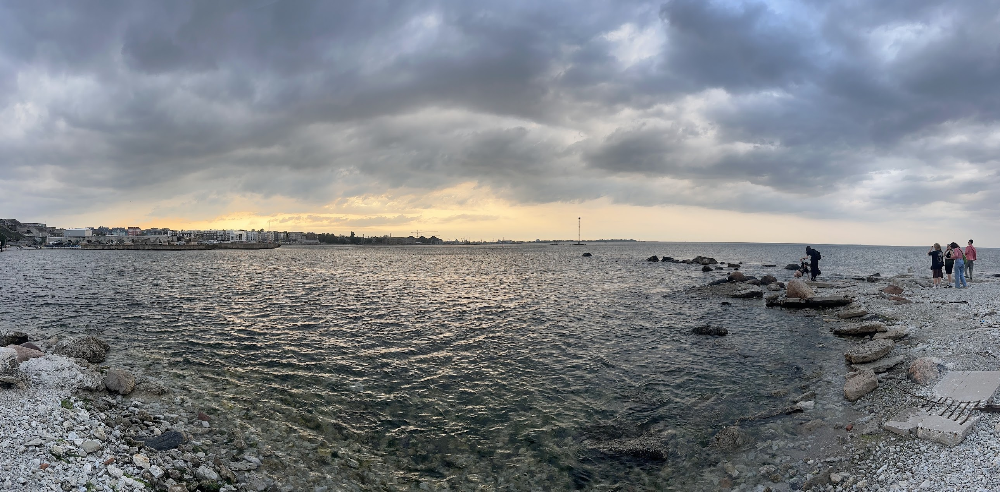
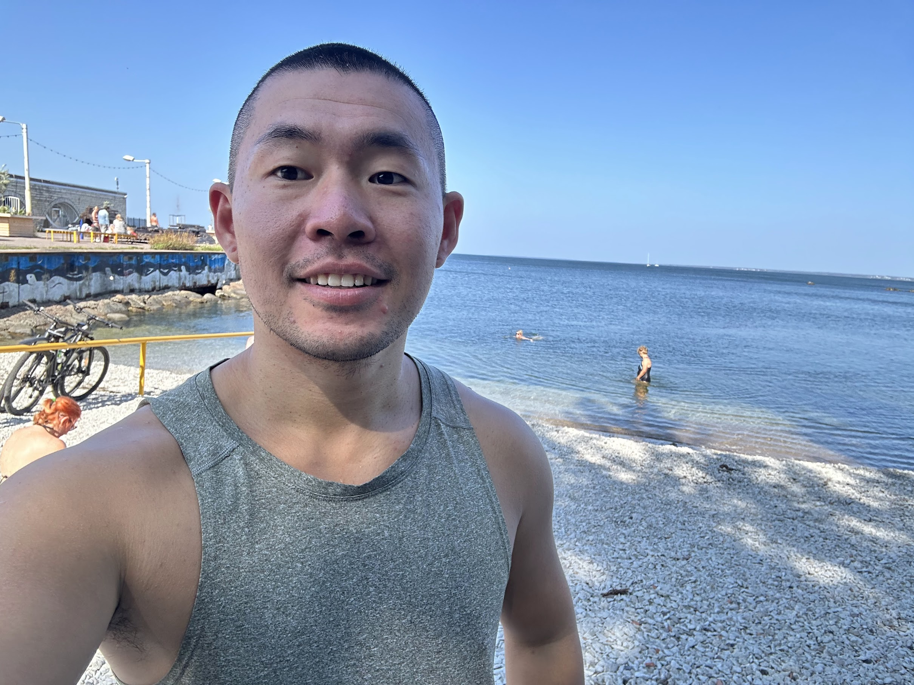

# Week 34: Dawn of the Master Study ✨

A long week, full of *first times* and new adventures. Let’s go day by day.  

---

## ✈️ The Journey to Tallinn  

**Aug 20** — Flew with Turkish Airlines on a **Boeing 777**. Honestly, they’re awesome:  
- 2 meals 🥘  
- Free goodies (socks, eye mask, headphones, blanket) 🎁  
- Entertainment system with games & music 🎮🎶  

At **Istanbul Airport**, Turkish Airlines gave me a free meal voucher. The waiter wasn’t thrilled about it 😅, but hey, food is food. I even managed to nap at the airport for free 🛌.  

Second flight was an **Airbus 320**. Old, but still had games — 2048 was fun, Angry Birds was a bad idea 😬.  

Landed in Tallinn at 6 PM. Met my study buddy Karl, but sadly my luggage got torn (part glued together, lol). Karl drove me around the **Old Town** 🏰, where I learned Estonian bachelor programs are just 3 years (lucky bastards).  

Checked into a hostel — very loud with drinking games every night 🍻, but thanks to red-eye exhaustion, I still slept well. Jet lag hit at 2 AM though (7 AM China time).  

---

## 🛂 TRP Card Adventure  

**Aug 21** — Had an appointment at the Police Station for my **TRP card** (residence permit that comes with free buses + some citizen perks 🚍).  

Two mistakes though:  
1. Booked the appointment far from the city center (accidentally stumbled into *Tallinna Laulava*, where the Singing Revolution happened 🎶✊).  
2. Went there with **zero documents** 😅.  

Somehow it worked out — fewer people in the suburbs, the officer let me fill the form at home and didn’t cancel my spot. She looked super strict, but at the end gave me a big smile and a *congratulations* 🎉.  

---

## 🛒 Settling In  

**Aug 22** — Grocery day! Checked out Prisma, Solaris, and Rimi. Verdict: **Rimi = cheapest** 🛍️.  

---

## 🌧️ Museum, Music & Drinks  

**Aug 23** — Rainy day, but full of social fun:  
- Museum of banned books 📚  
- Listened to Estonians sing a **Chinese song** 🎤🇨🇳  
- Three different bar rounds:  
  - Alcohol coffee ☕️+🍸  
  - Open karaoke (my *first ever* karaoke on stage 🎤😳)  
  - Irish jazz bar 🎷 (ended up in deep convos about Chinese history with a Lithuanian guy).  

Got properly drunk 🍻😂.  

---

## 😴 Hangover & Moving  

**Aug 24** — Moved from hostel to school dorm. Too hungover, slept all day 🛌.  

---

## 🌊 Big Meetup by the Sea  

**Aug 25** — Found a local Asian food store (only opens afternoons 🍜). It was a hot 28°C ☀️ — my Norwegian friend Erik said he was dying 🥵.  

Huge international student meetup — so many people it felt like a parade 🎉. Even boats by the shore blew their horns for us 🚢.  

I tried the water earlier, so I dragged Erik to jump in with me 🌊. Got a few cuts (coastal rocks, ouch), but it was worth it — super fun and crazy.  

Met my roommate **Svet** — super clean guy, already helped me tidy the kitchen 🧽. Excited to see what next week brings!  
