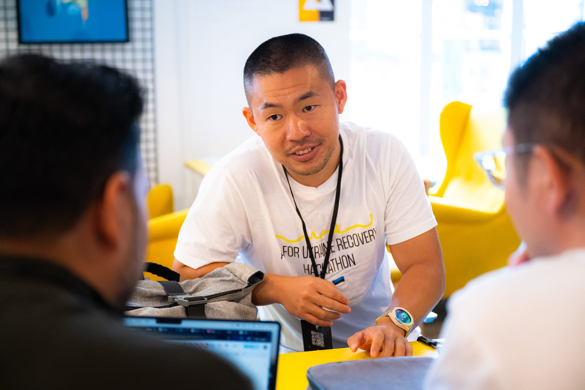

# 🚀 Week 36: My First Hackathon in Estonia 🇪🇪

This weekend, I joined my **first hackathon in Estonia**, hosted at **Palo Alto Club, Telliskivi**. Telliskivi is like a startup accelerator hub 🏢, full of energy and innovation. This hackathon’s goal was to **support Ukraine** 💙💛.  

---

## 👥 Forming the Team

I registered as an **individual developer** 🧑‍💻. Since the rules required teams of at least 3 people, I was lucky to meet **two awesome Chinese founders** building a startup in Estonia 🇨🇳✨.  

Their idea:  
- Use **AI to analyze Bitcoin** and detect **dormant wallets** 🪙  
- Treat these wallets like **gold reserves in banks** 🏦  
- Generate interest using these coins 💹  
- Verify ownerless accounts with the [Odin protocol](https://odinprotocol.io/) 📡  

The technical side seemed doable. The big question 🤔: **Can we legally use these coins?**  
It turns out, governments may allow it, similar to how **dormant assets** (like unclaimed houses) can be reclaimed after a period 🏠⚖️.  

---

## ⚔️ Day 1 – Battlefield Vibes

The first day felt like a **battlefield** 🪖.  
- Mentors swarmed around, asking tough and sharp questions 💡  
- They were experts from different fields, super fast at spotting weaknesses ⚡  
- By afternoon, our team was **exhausted** 😵  

Still, I joined a lecture about **distributed machine learning** 🧠. It’s not my field, but it was fun to learn something new.  

---

## 📊 Day 2 – Presentation Bootcamp

On the second day, we wrapped up our **slides** 📑. Then came a fantastic **mentoring session on pitching** 🎤.  

What I learned:  
- Start with a **15s project intro**, then let a teammate repeat what they understood 🔄  
- Emphasize **your team’s strength** 👥  
- Use body gestures, but only when necessary ✋  
- Keep the audience focused—don’t let them drift away 👀  
- Be friendly with the technical team 🤝  

This session was gold ✨. I learned so much about **how to present a startup idea effectively**.  

---

## 🏆 Results

We didn’t win anything 🫠, but the top prizes were super inspiring:  
1. 🥇 **YOLO for damage detection in Ukraine** – strong tech + solid business plan  
2. 🥈 **Resilient info database** – like Excel, but works in crises (e.g., COVID) 📊  
3. 🥉 **AI chatbot for parents** – helping them manage children’s emotions 👶💬  

Other fun ideas included:  
- A **Tamagotchi-like app** 🐥 where kids interact with a digital pet that secretly helps track emotions for parents.  

---

## 🎧 Wrap-up

The hackathon was **super fun** 🎉, full of inspiration, teamwork, and learning.  
The only downside: I **lost my earphones** 😭… bad news for my podcast habit.  

Still, what a **memorable first hackathon experience in Estonia**! 💙
