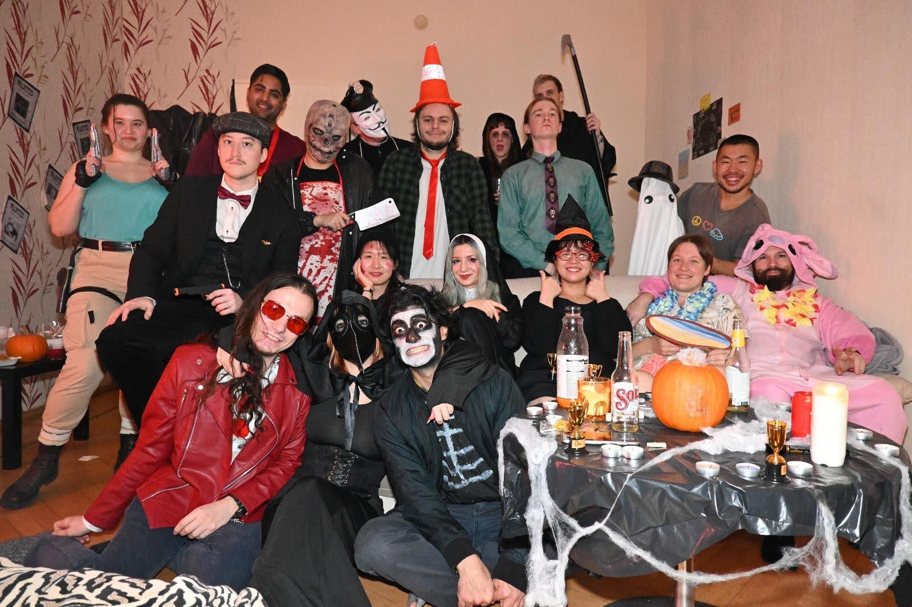

# Week 44: Halloween 🎃👻

This was my **first Halloween ever**!  
I dressed up as a ghost with nothing but a white sheet from JYSK (cheap & effective 😅). Couldn’t find a costume shop nearby, and honestly, I couldn’t afford an expensive one anyway.  

We played an **escape room game** in some second-year students’ apartment. They had prepared everything really carefully — and it turned out super fun! 🙌  

---

## RenderDoc 🖥️

Last month, I spent a lot of time struggling with **WebGL shaders**.  
Not only am I not super familiar with the syntax, but I also wasn’t sure *when* to use shaders or *how* to debug them 🤯.  

ChatGPT helped a lot (shoutout 🙏), but it still wasn’t enough.  

Then I discovered **RenderDoc** — a free, open-source graphics debugger that lets you capture and replay frames. I haven’t used it yet, but I’ll definitely try it next time.  

Meanwhile, in my **2D graphics class**, I learned some fun effects in Krita 🎨. I think I’ll try recreating them with shaders soon.

---

## Meta Spatial SDK 🕶️

While helping some students with their VR project, I found out that **Meta already released their Spatial SDK**.  
It even has support for **Android Studio** and **Unreal Engine**.  

Gonna test both in the coming weeks 👀.

---

## EdTech Hackathon 🚀

I joined a team for an **EdTech Hackathon**! We’re working on an app to help people study Estonian 🇪🇪.  

I came across [Ekilex](https://github.com/keeleinstituut/ekilex/wiki/Ekilex-API) — a digital Estonian dictionary API. The catch? The whole website is in Estonian 😅. So I’ll need some time to figure out how to actually use it.  

Excited to see where this goes! 🙌
