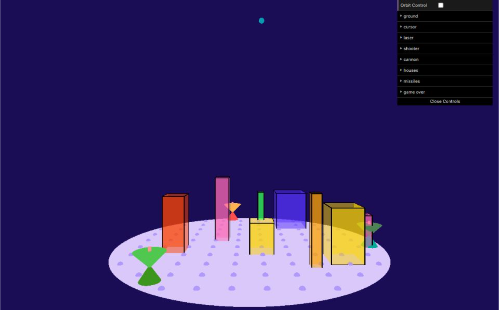

# Week 48: ECS

Because I am a web developer, I am more familiar with MVC design pattern. I have already heard of ECS design pattern in Game development. I decide to implement it in the Digital Graphic and Digital Sound Course work.

The graphic idea is from [Airspace Defender](https://www.meta.com/en-gb/experiences/airspace-defender/7523170214434197/?srsltid=AfmBOoqRU1rANUexpLi7gnPuKhJrlrwnxUr5mEepMZagoInHAm6Uj7RC). Originally I want to make a webXR one using [p5xr](https://p5xr.org/). But it looks the project is not maintained for a long time. So I decide not to invest time on it this time.

The whole developing time is one week of the spare time after school.

## goals

- [o] ECS design pattern
- [o] 3D graphic
- [o] Stereo sound
- [x] WebXR

## Gameplay

The player use mouse to click the dots on the plane. The mouse down time is to decide the hight of the marker. 

The laser will shoot the marker to protect the city. When every building on the plane is destroyed, the game is over.

## Development

Set the `DEV` variable in the first line to `true` to enable the development mode. You can edit the color and the position of some entities.



`axisHelper` is a helper function generated by chatGPT. The prompt is `p5js, 3D space, give me an axisHelper`. It is very usable to debug the position of the entities.

## Classes

### Entity

```js
class Entity(id) {
    addComponent(component) 
    getComponent(componentClass): component
    hasComponent(componentClass): boolean
}
```

### Component

```js
class Position(x,y,z) {}
class Color(r,g,b) {}
class LaserHeadColor extends Color { }
class LaserBodyColor extends Color { }
class LaserEmitterColor extends Color { }
class LaserColor extends Color { }
```
Most tutorials suggest to make `Position` and `Color` as `Component`. Right now, I think it is a bad practice. Because a `Position` is only a vector. And a `Color` is only a string. There is no need to abstract them as a `Component`.

```js
class Ground(r) {}
class Laser(size, speed) {}
class Houses(num, minH, maxH, minW, maxW) {}
class Missiles(
    size, radius, height, interval, speed,
) {}
class GameOverText() {}

class Cursor(radius, space, height) {}
class SphereCollider () {}
class Sound(
    sound,
    attackTime,
    decayTime,
    sustainRatio,
    releaseTime,
    frequency,
    reverbTime,
    delayTime,
    delayfeedback
) {}
```

The above are good practice. Especially `Sound` and `SphereCollider`. They can be reused in many `Entities`.

Another good practice. Like `Houses` and `Missiles`. There is no need to add an entity for each individual. They can be stored in an array in one Component.

### System

```js
class System(entities) {}
class GameOverSystem(entities) {}
```

## Graphic

### RayCasting

In line 1106-1137 `mouseMoved()`. This is not what I initially wanted to implement. But considering that there is only one direction. So I let ChatGPT to generate it. The prompt as follows.

```
In the p5js 3D environment, a plane is placed on the xz axis, with the y axis slightly down. I want click on the plane. please return the value of the point. It should be in the plane's xz axis. The default camera position of p5js is (0,0,800), and the fov is 2 * atan(height / 2 / 800)
```

ChatGPT is not very good at math. The result still needs adjustment. But it is almost correct.

### Collision Detection

#### House.isValidPlacement()

The house placement is randomly generated circling the center of the plane (0,0). The `isValidPlacement` function is to check if two houses overlaping each other.

```js
    let corners = [
      createVector(pos.x - size.x / 2, pos.y - size.y / 2),
      createVector(pos.x + size.x / 2, pos.y - size.y / 2),
      createVector(pos.x - size.x / 2, pos.y + size.y / 2),
      createVector(pos.x + size.x / 2, pos.y + size.y / 2),
    ]

    for (let house of houses) {
      if (house.pos) {
        let otherCorners = [...]
        for (let c1 of corners) {
          for (let c2 of otherCorners) {
            if (abs(c1.x - c2.x) < size.x && abs(c1.y - c2.y) < size.y) {
              return false // Corners overlap
            }
          }
        }
      }
    }
```

Hint that until then the `SphereCollider` is not yet implemented. The house will overlap the lasor. And if the houses use the `SphereCollider`, the `isValidPlacement` can be much easier.

#### Missiles.isHitingBuilding()

Because the `sphereCollider` is not implemented. The missile hitting the building is like a `boxCollider`. Needs to calculate the nearest point on the box to the missile. Need to remind that the y axis is upsetdown in WebGL.

```js
    const mX = position.x
    const mY = position.y
    const mZ = position.z

    const hLX = pos.x - size.x / 2
    const hRX = pos.x + size.x / 2
    const hBY = houseY
    const hTY = houseY - size.y
    const hFZ = pos.y - size.z / 2
    const hBZ = pos.y + size.z / 2

    const closestX = constrain(mX, hLX, hRX)
    // !important the axis is upsetdown
    const closestY = -constrain(-mY, -hBY, -hTY)
    const closestZ = constrain(mZ, hFZ, hBZ)
    const distX = position.x - closestX
    const distY = position.y - closestY
    const distZ = position.z - closestZ

    const isHiting = distX * distX + distY * distY + distZ * distZ <= r * r

    return isHiting
```
#### System.updateMissiles()

As I mentioned. Using a `SphereCollider` can make the code much easier. Line 908-914, is the missile hit the marker and, Line 916-923 is the missile hit the laser machine.

```js
// 908-914 hit marker
const position = createVector(x, y, z).add(m.position)
laser.expPos.forEach(pos => {
    const distance = p5.Vector.dist(pos, position)
          
    if (distance < (explodeRadius + mComponent.size)) {
            mComponent.hit(m, position)
    }
})
```

```js
// 916-923 hit the laser machine
const collider = e.getComponent(SphereCollider)
const distance = p5.Vector.dist(collider.pos, position)
if (distance < (collider.radius + mComponent.size)) {
    mComponent.hit(m, position)
    collider.hit()
}
```

### The Laser Machine

The laser machine is a the very first entity I implemented in the project. It is a very bad practice looking back at it. I am going to make a conclusion about this part.

#### System.updateLaser()

Line 635-755. I made a complex model for this machine. A laser machine is consisted with the following parts.

- cylinder as the emmiter
- Cone as the laser head
- Another cone as the body
- a line to connect the marker and the laser head
- a sphere to show the explosion
- a sphere as the collider

The head was intially designed to be able to rotate. But I got lost in the coordination calculation. It is not a easy work to get the world coordination of the current object in p5.js. And mix game logic inside drawing is a terrible idea.

```js
// This is a bad practice
push()
translate(v1)
// some code
push()
// some code
translate(v2)
push()
// some code
translate(v3)
// now the world coordination is v1 + v2 + v3
// the relative coordination is (0,0,0)
pop()
pop()
pop()
```

In conclusion. I was told to write logic in the `System` class. But I think it is better to leave the logic and states in the `Component` class. The `System` should only include the drawing part. Like the view of the `MVC` design pattern. 

### Explosion

In line 655-672. I found a very easy way to implement explosion by using `framecount` and `setTimeout`.

```js
    if (collider.isDestroyed) return

    laser.expPos.forEach((exp) => {
      push()
      translate(exp.x, exp.y, exp.z)
      fill(
        frameCount % 10 > 5 ?
        laser.explodeColor :
        laser.explodeHighlight + "7F"
      )
      sphere(laser.explodeRadius)
      pop()
    })
```

In this way, you do not need to store the a time value and update it every frame. But since `setTimeout` is a browser event source, it will stop the queue when the tab is not active.

## Sound

### Background Music

The background music is from [freesound.org](https://freesound.org/people/josefpres/sounds/655822/). It is too long, I cut it into 6 seconds to make the file smaller.

### Sound Component

Both the laser sound and the missile hit sound are using `Sound` Component. Laser uses the triangle Oscillator the missiles use the noise.

Besides the `Reverb` and `Delay` to make the stereo effect. I also set the volumn and the pan value base on the position of the sound source, in line 240-266.

```js
    const maxV = map(pos.z, zMin, zMax, 0, 1)
    this.env.setRange(maxV, 0)

    const panV = constrain(
      map(pos.x, xMin, xMax, -1, 1),
      -1, 1,
    )
    this.sound.pan(panV)
```

To make the missile hit sound quick, I set `releaseTime` to 0.02 and 0 to both `delayTime` and `delayFeedback`.

#### Performance issue

The `p5.Reverb` and `p5.Delay` object use a lot CPU time. To create them every time the hit function calls may cause glitch. It is better to create them in the `setup` function and set the volume to 0.

### Compare MVC and ECS

I have to say the ECS is not very far from MVC. The Component is basically the Model and Controller. And System is doing View's job. 

In a MVC design pattern, usually we will use a reactive pattern to watch every event source. In this way, the layout only changes when event source change. But as the quantity of event source getting larger, the project will need to maintain a complex state machine. But smaller project may not need a state machine.

In ECS, you don't need a reactive pattern. The screen will always refresh every frame. It is a polling pattern. The state is always important. Even for the small project.