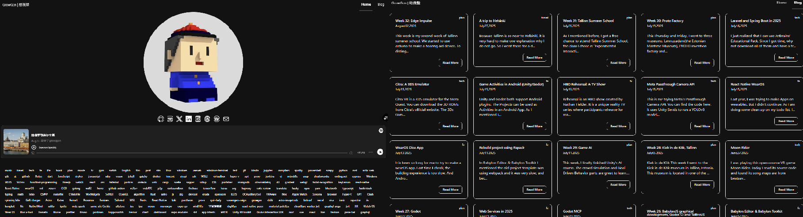

# Website Rebuild

If you noticed, I am rebuilding my website again.

## Story of the website

At first, this website was built for me to record [my graduation trip](/travel/2015/03/28/Bohai-Rim). I used Jekyll with a jQuery template. Because I didn't find a suitable image hosting, the trip site was never done. However, since then I started post some tech articles until now.

Later in 2020, I rebuild [the website into Gatsby](/fe/2020/03/05/Jekyll-Gatsby). I wanted to use graphql, and I made this website structure into date based folder style. Reread this blog I wrote 5 years ago. I believe that untill now, I still think changing to Gatsby is not a good idea. Yeah, graphql is disappointing...To be honest, I always wanted to find an alternate.

In 2023, when I saw Astro started to support [View Transition](/plan/2023/08/20/33rd-ViewTransition), I thought it is the time. But then I got burned out transfering into the new tech stack. I have to admit, although Gatsby is feels too compound, it handles markdown files and images better than Astro, at least then. 

And becuase there were too many legacy files, I had to think about monorepo solutions. I wasted too much time building a dark mode switch and the infinate scroll. Also ViewTransition has many limitation that not able to simpily be applied on any DOMs. Eventually, the website UI was just orgininal shadcn.

Recently, I have to rebuild the website, because every build of one commit costs me over 44min. Here goes the rebuild story.

## This Rebuild

At first, I just want to make an incremental build modification, this feature was introduced in Astro v4 but got revoke in Astro v5. Then I decided to change one stack, maybe [11ty](https://www.11ty.dev/) or [hugo](https://gohugo.io/). With the Gatsby rebuild history, I realized to transfer a content website into another stack, you need to consider too many, File structures, markdown contents, images, latex... 

Probably stay on Astro stack, plus, I never finished the ViewTransition part. There is a good thing that Astro has, it supports multiple frameworks to write components. My personal opinion, island archetecture is better than RSC. It gives me more choises than other framework can give.

On the UI, I decide to change shadcn to [Mantine](https://mantine.dev/). In comparison, Mantine is way equiped than [shadcn](https://ui.shadcn.com/), even with [radix UI](https://www.radix-ui.com/). Shadcn uses tailwind, I personaly do not like a big CSS reset, although I am still using Tailwind in this build. The only unhappy problem is that Mantine is actually not supporting Astro (need a little modification). In the blog list page, I used MUI's [Masonry](https://mui.com/material-ui/react-masonry/). I wanted to build masonry since the last build, however, I am still not satisfied with the latest one, eventough, it is better.

This rebuild aims to build an in browser AI, supports more social contents and support my portfolios. right now I am still refining the UI. I hope the goals will be reached.

