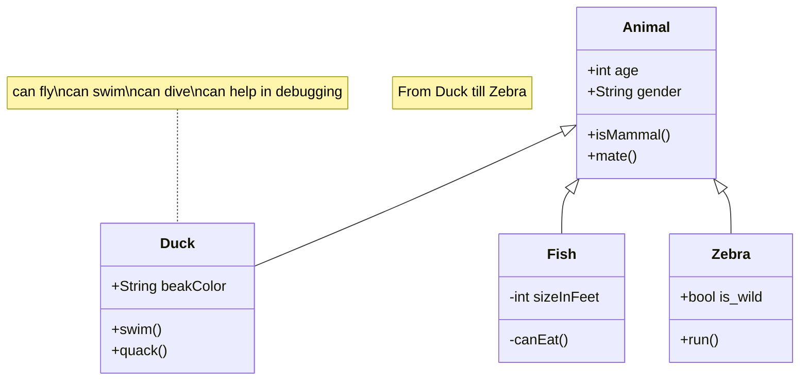
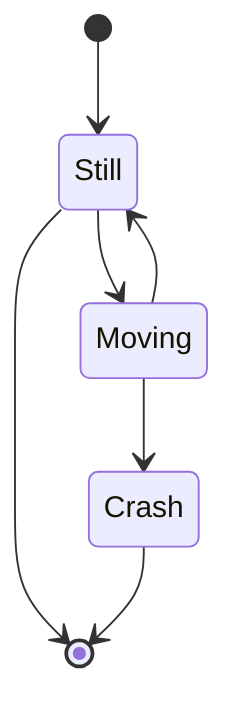
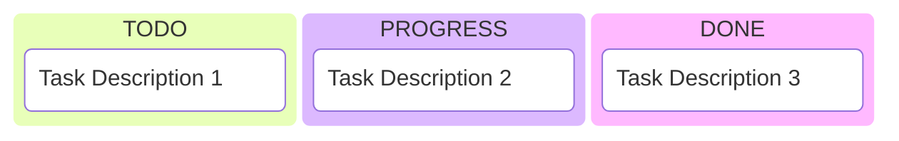

# Mermaid: Wait, UMLs are Back!

I'm genuinely surprised that UML diagrams are still useful today! 😮 When I started my software engineering journey, we used the Waterfall methodology where UMLs were absolutely essential tools. You had to design the entire system upfront before writing any code - what we now call Big Design Up Front (BDUF). Some government projects still follow this approach today.

Back then, UMLs served as the perfect communication bridge between designers and developers. Text descriptions simply couldn't capture the complex relationships between systems as clearly as visual diagrams could. 📊

## The Agile Era: UMLs Take a Back Seat 🏃‍♂️

When I transitioned to working with Agile methodologies, everything changed. Sprint cycles became so short that creating UMLs felt unnecessary and time-consuming. For years, I didn't touch UML diagrams at all. I even wrote a blog post about [PlantUML](/fe/2017/12/20/plantuml) during that period, thinking it might be one of the last useful UML tools.

I genuinely believed UMLs were dead. 💀

## AI Brings UMLs Back to Life 🤖✨

But here's the twist - AI has brought UMLs back into relevance! When I'm prompting with AI systems, I still need to describe relationships and system architectures clearly. Current multimodal LLMs aren't sophisticated enough to understand complex system relationships from text alone.

This realization led me to discover [Mermaid](https://mermaid.js.org/) - a more powerful and flexible alternative to PlantUML. 🚀

## Class Diagrams: The Foundation 🏗️

Here's a classic example of a class diagram using Mermaid:

```txt
classDiagram
    note "From Duck till Zebra"
    Animal <|-- Duck
    note for Duck "can fly\ncan swim\ncan dive\ncan help in debugging"
    Animal <|-- Fish
    Animal <|-- Zebra
    Animal : +int age
    Animal : +String gender
    Animal: +isMammal()
    Animal: +mate()
    class Duck{
        +String beakColor
        +swim()
        +quack()
    }
    class Fish{
        -int sizeInFeet
        -canEat()
    }
    class Zebra{
        +bool is_wild
        +run()
    }
```



## State Diagrams: Perfect for Game Design 🎮

State diagrams are incredibly useful for game development and behavior trees:

```txt
stateDiagram-v2
    [*] --> Still
    Still --> [*]

    Still --> Moving
    Moving --> Still
    Moving --> Crash
    Crash --> [*]
```



## Kanban Boards: Project Management Made Visual 📋

Surprisingly, Mermaid can even create Kanban boards:

```txt
kanban
  column1[TODO]
    task1[Task Description 1]
  column2[PROGRESS]
    task2[Task Description 2]
  column3[DONE]
    task3[Task Description 3]
```



You can explore many more chart types in the [official Mermaid documentation](https://mermaid.js.org/intro/). 📚

You can use [astro mermaid](https://github.com/joesaby/astro-mermaid) to add these diagrams on your astro websites.

## Looking Forward: The Future of Visual Documentation 🔮

I still believe that future multimodal AI systems will become smart enough to interpret hand-drawn UML diagrams directly. When that happens, tools like Mermaid might become less critical. 

However, until then, Mermaid remains an incredibly handy tool - much like Markdown or LaTeX. It's a geek-friendly solution that bridges the gap between human understanding and AI communication. 🛠️

Whether you're designing complex systems, creating game mechanics, or just need to visualize relationships clearly, UMLs are definitely back in the toolbox! 🧰✨