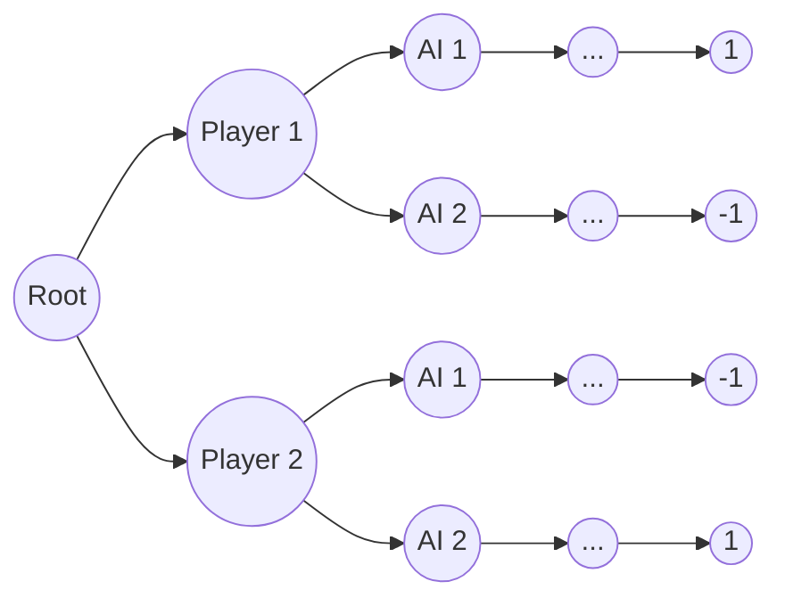

# Use Mini-Max Algorithm to Play Tetris

I think I never heard of Mini-Max Algorithm. Yes, as the teacher asks anyone know this algorithm I though it was [the AI company](https://www.minimax.io/). 

But when he issued a sample. Player and PC play in turns, they can choose to move the same piece 1 step or 2 steps. The first get to the end wins. I realized that it is simple to just build one binary tree, to find the leaf == 0 or less than 0. Count the branches, if it is odd,player wins, even, PC wins.

<!-- <iframe src="https://step-game.vercel.app/" class="max-w-screen-md m-auto" alt="the example game"> -->

This is actually very close to the mini-max algorithm. The so called Mini Max algorithm means calculate the smallest value for the opponent and calculate the max value for your self.

Think back at the example. At my turn, which way suppose to make me gain more?

Let's define the results.

$$
\begin{cases}
    1 win \\
    -1 lose
\end{cases}
$$

So the decision tree should look like this.(The result part is just demostration)

Every time AI moves, it calcutates the results. For example. `Player1 -> AI1` leads to 1 but `Player1 -> AI2` leads to -1, `max("Player1 -> AI1", "Player1 -> AI2")` is `Player1 -> AI1`. then AI should take 1 step.

At the same time, AI can also predict player move, choose the branch that player gains minimum the AI can also win.

> unfinished ...
