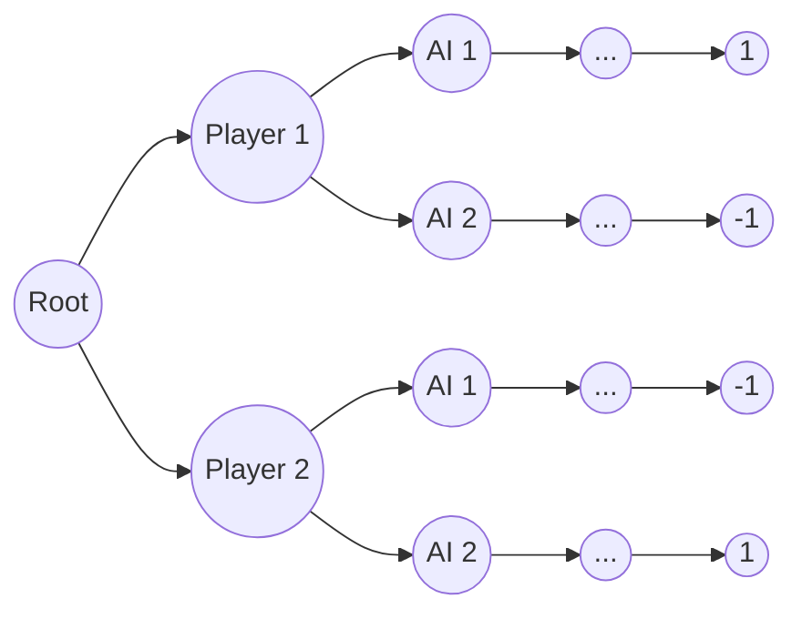
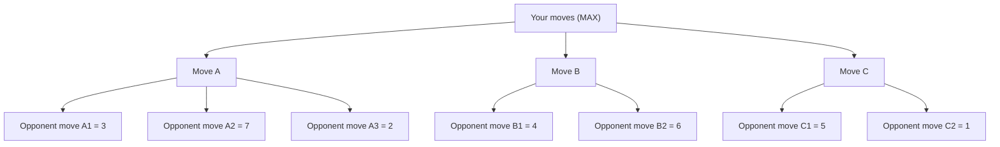

import DescriptionImage from '@/packages/image/DescriptionImage';


# Using Mini-Max Algorithm to Play Tetris 🎮

So here's a funny story - when my teacher first mentioned the "Mini-Max Algorithm," I immediately thought of [that AI company](https://www.minimax.io/) 😅. Had no clue it was actually a classic game theory algorithm!

But then he showed us this simple example: two players take turns moving the same piece either 1 or 2 steps forward. First one to reach the end wins. That's when it clicked! 💡

You basically build a binary tree and find leaves that equal 0 or less. Count the branches - if it's odd, player wins; if even, PC wins. Pretty neat, right?

<iframe src="https://step-game.vercel.app/" class="max-w-screen-md m-auto" alt="the example game"/>

This is actually super close to the real Mini-Max algorithm! The core idea is simple: **calculate the worst-case scenario for your opponent while maximizing your own benefit**.

Let's think about it this way - at my turn, which move gives me the best advantage? 🤔

Let's define our win conditions:

$$
\begin{cases}
    1 \text{ win} \\
    -1 \text{ lose}
\end{cases}
$$

## Mini-Max Decision Tree Structure 🌳

Here's how the decision tree should look:


Every time the AI moves, it calculates all possible outcomes. For example: if `Player1 → AI1` leads to +1 but `Player1 → AI2` leads to -1, then `max("Player1 → AI1", "Player1 → AI2")` is obviously `Player1 → AI1`. So the AI should take 1 step.

The cool part? The AI can also predict player moves and choose the branch where even if the player gets minimum benefit, the AI can still win! 🧠

## Building a 1v1 Tetris Game 🎯

Now here's where it gets interesting - let's create a competitive Tetris game: Player VS AI!

<DescriptionImage src="https://res.cloudinary.com/dmq8ipket/image/upload/v1757420601/1v1_cniq84.png" alt="Game start screen showing split view" >
    **Game Start**: Player and AI split the screen - you're on the bottom playing regular Tetris, AI gets the top half 🎮
</DescriptionImage>

<DescriptionImage src="https://res.cloudinary.com/dmq8ipket/image/upload/v1757420602/1v1-up_q4k36l.png" alt="Reward system in action" >
    **The Twist**: When either side clears a row, they get rewarded with +1 row of space, while their opponent loses one row! Talk about pressure! 😤
</DescriptionImage>

The game continues until someone runs out of space to place pieces. It's like Tetris meets territorial warfare! ⚔️

## Scoring System - The Math Behind the Magic 🧮

To make Mini-Max work, we need a solid scoring system. Let me break down how we evaluate each possible move:

<DescriptionImage mah={1600} src="https://res.cloudinary.com/dmq8ipket/image/upload/v1757423926/Screenshot_2025-09-09_161709_wdnjql.png" alt="Tetris board analysis example">

**Tetris Board Evaluation Example**: Here's what happens when we drop this "Z" piece without rotation

Let's look at our key metrics:

**🏗️ Height**: $ 28 = 4 + 0 + 0 + 5 + 5 + 4 + 3 + 2 + 1 + 4 $  
*Lower is better - we don't want towering stacks!*

```ts
getHeightsSumIfDropped(specs: { tetromino: Tetromino, startCol: number }[]): number 
```

**🧹 Cleared Rows**: $ 0 $  
*Higher is better - more cleared rows = more points*

```ts
getClearedRowsCountIfDropped(specs: { tetromino: Tetromino, startCol: number }[]): number
```

**🕳️ Holes**: $ 4 $  
*Lower is better - holes are the enemy of Tetris*

```ts
getHolesCountIfDropped(specs: { tetromino: Tetromino, startCol: number }[]): number
```

**📈 Gradient**: $ 16 = |4-0| + |0-0| + |0-5| + |5-5| + |5-4| + |4-3| + |3-2| + |2-1| + |1-4| $  
*Lower is better - we want smooth, even surfaces*

```ts
getAdjacentHeightDiffSumIfDropped(specs: { tetromino: Tetromino, startCol: number }[]): number
```

</DescriptionImage>

## Finding the Perfect Coefficients 🎯

Now we need to weight these factors. Our scoring formula looks like this:

$$
Score = 
(a, b, c, d)
\begin{pmatrix}
    Height \\
    Rows \\
    Holes \\
    Gradient \\
\end{pmatrix}
$$

Instead of reinventing the wheel, I found that [someone already solved this using Genetic Algorithms](https://codemyroad.wordpress.com/2013/04/14/tetris-ai-the-near-perfect-player/) 🧬. Here are the magic numbers:

$$
a = -0.510066 \\
b = 0.760666 \\
c = -0.35663 \\
d = -0.184483
$$

## Implementing Mini-Max in Tetris, First Try 🤖

Here's where it gets tricky - Tetris pieces are random! So our decision tree height is usually just 1. But if we know the next few pieces in the sequence, we can go deeper.

**Move Analysis for Each Piece**:

| **Horizontal Movement (9 positions)** 🔄 | **Rotation Options (4 rotations)** 🌀 |
|---------------------------|--|
||  |

For each piece, we typically have around 36 possible moves (9 positions × 4 rotations). Consider if we show a sequence of pieces not only one, the calculation will be $36^n$. Definately need pruning. 

Another thing… this game currently only uses the **Max** part of the Mini-Max algorithm 🤯.  
Yeah… I think I need to change my plan.  

## 🎮 Change into Turns Game

Ohh, wait! I might have overcomplicated things 😅.  
What if I make it a **turn-based game**? The player and the AI take turns.  
Each turn, I’ll show **two pieces**:  
- one for the current player,  
- one for the opponent.  

That way, the AI can actually use the **full Mini-Max algorithm**! 🧠✨  

## 📜 Rules

So, what about the rules… 🤔

Classic Tetris scoring looks like this:

| Row clear | Points |
|--|--|
| Single | 100 |
| Double | 300 |
| Triple | 500 |
| Tetris | 800 |

There are also some high-level moves like **T-Spin** (when you rotate the T piece at the very last moment to clear rows).  
I probably won’t implement it (too tricky to test 😅), but here are the points anyway:

| Row clear | Points |
|--|--|
| Single | 800 |
| Double | 1200 |
| Triple | 1600 |

And don’t forget *Combos* 🔥 — every time you chain clears, you get **+50 points** extra.  

## 🎨 The UI – Upgrading Pixtris 


Okay, coding time 🚀. Since there are already tons of Tetris clones out there, I didn’t reinvent the wheel. Instead, I picked an open-source project called [pixtris](https://github.com/ajur/pixtris) (originally built with Pixi.js v4) and upgraded it to **Pixi.js v8 + TypeScript**. 
 👉 You can check out my fork here: [github.com/gongbaodd/pixtris](https://github.com/gongbaodd/pixtris). 

--- 

### 📊 Scoreboard with Lit.js

 For the scoreboard UI, I used **Lit.js**. Why? 
 
 - It’s *non-invasive*, so I didn’t need to wrap the whole Pixtris project in a new framework. 
 - I could just drop a web component in. 
 - And honestly... I wanted to finally test Lit in a real project. 
 
 But here’s the verdict: 😅 It feels very **2018**. Web Components sounded promising, but now we’re living in the **hooks era**. 
 Also, Lit.js needed some extra TypeScript configs: 
 
 ```json 
 { 
    "useDefineForClassFields": false, 
    "experimentalDecorators": true 
} 
 ``` 
 --- 
 
### 🎨 Styling with Tailwind + DaisyUI
 
Since Lit.js doesn’t come with a big UI ecosystem, I went with **Tailwind** + **DaisyUI** (the universal solution). 
⚠️ But here’s the trap with Web Components: they **don’t share stylesheets** with the parent document. 
That means you gotta import CSS *inline* inside your component: 

```js
import daisyCss from "../style.css?inline" 
```
--- 

### 🔄 State Machine

For state management, I kept it simple: just used **nanostores**. Lightweight and good enough for this project ✨. 

---

## 🧠 Mini-Max Logic – Making Tetris Think

So here’s the fun part – I wanted to give Tetris some brains. I implemented a **Mini-Max algorithm**, commonly used in turn-based games. 
The idea: 

- Every move *you* make (MAX) → your opponent (MIN) tries to minimize your score. 
- You then choose the move that maximizes your outcome, assuming the opponent always makes the worst choice for you. 



Opponent’s evil choices 😈: 
    
    - Move A → picks **A3 = 2** 
    - Move B → picks **B1 = 4** 
    - Move C → picks **C2 = 1** 
    
So your best option is **Move B** (score 4). 

--- 

### 🚫 But There’s a Catch

In Tetris, the opponent can “choose” invalid placements (aka **-Infinity**). That means the AI ends up being more like a chaotic gremlin 👾 
instead of a strategic genius. To fix that, I just ignored all the **-Infinity nodes**.
 This way, the AI plays reasonably without sabotaging everything. Here’s what the decision tree looks like: 
 
  

```ts
    type Branch = Map<number/*column num*/, Map<number/*rotation count*/, number/*score*/ | Branch>>;
    /**
	 * Build an evaluation map for all columns and rotations for a given tetromino.
	 * The returned Map has keys as column indices. Each value is a Map whose keys
	 * are rotation indices (0..3) and values are the evaluation score computed as:
	 *   -0.510066 * getHeightsSumIfDropped
	 * +  0.760666 * getClearedRowsCountIfDropped
	 * + -0.35663  * getHolesCountIfDropped
	 * + -0.184483 * getAdjacentHeightDiffSumIfDropped
	 * Invalid placements are scored as Number.NEGATIVE_INFINITY.
	 *
	 * This method does not mutate the provided tetromino or the board.
    */
    getPlacementEvaluationMap(tetrominoes: Tetromino[]): Branch
```
 
 Applying the move inside `spawnTetromino()`. 
 
 --- 
 
 ### 🐛 Known Bug

There’s still a sneaky async bug: sometimes the turn algorithm fails and the AI just takes over the game completely 🤖.
I call it a *feature* now 

– an evil AI mode. 💀 

--- 

## 🎮 Try It Out 

👉 Wanna play? Check it out here: [pixtris.vercel.app](https://pixtris.vercel.app/) 

🎉 Tip: if it feels too fast, hit pause ⏸️ and think about your next move!
