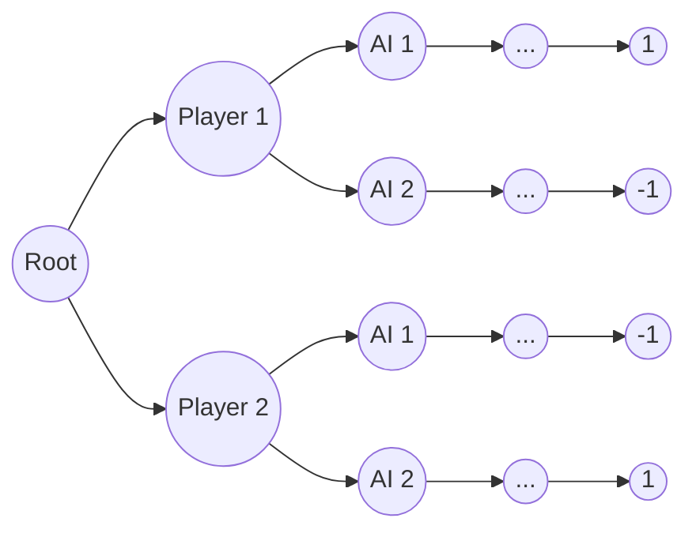

import DescriptionImage from '@/packages/image/DescriptionImage';

# Using Mini-Max Algorithm to Play Tetris 🎮

So here's a funny story - when my teacher first mentioned the "Mini-Max Algorithm," I immediately thought of [that AI company](https://www.minimax.io/) 😅. Had no clue it was actually a classic game theory algorithm!

But then he showed us this simple example: two players take turns moving the same piece either 1 or 2 steps forward. First one to reach the end wins. That's when it clicked! 💡

You basically build a binary tree and find leaves that equal 0 or less. Count the branches - if it's odd, player wins; if even, PC wins. Pretty neat, right?

<iframe src="https://step-game.vercel.app/" class="max-w-screen-md m-auto" alt="the example game"/>

This is actually super close to the real Mini-Max algorithm! The core idea is simple: **calculate the worst-case scenario for your opponent while maximizing your own benefit**.

Let's think about it this way - at my turn, which move gives me the best advantage? 🤔

Let's define our win conditions:

$$
\begin{cases}
    1 \text{ win} \\
    -1 \text{ lose}
\end{cases}
$$

## Mini-Max Decision Tree Structure 🌳

Here's how the decision tree should look:

Every time the AI moves, it calculates all possible outcomes. For example: if `Player1 → AI1` leads to +1 but `Player1 → AI2` leads to -1, then `max("Player1 → AI1", "Player1 → AI2")` is obviously `Player1 → AI1`. So the AI should take 1 step.

The cool part? The AI can also predict player moves and choose the branch where even if the player gets minimum benefit, the AI can still win! 🧠

## Building a 1v1 Tetris Game 🎯

Now here's where it gets interesting - let's create a competitive Tetris game: Player VS AI!

<DescriptionImage src="https://res.cloudinary.com/dmq8ipket/image/upload/v1757420601/1v1_cniq84.png" alt="Game start screen showing split view" >
    **Game Start**: Player and AI split the screen - you're on the bottom playing regular Tetris, AI gets the top half 🎮
</DescriptionImage>

<DescriptionImage src="https://res.cloudinary.com/dmq8ipket/image/upload/v1757420602/1v1-up_q4k36l.png" alt="Reward system in action" >
    **The Twist**: When either side clears a row, they get rewarded with +1 row of space, while their opponent loses one row! Talk about pressure! 😤
</DescriptionImage>

The game continues until someone runs out of space to place pieces. It's like Tetris meets territorial warfare! ⚔️

## Scoring System - The Math Behind the Magic 🧮

To make Mini-Max work, we need a solid scoring system. Let me break down how we evaluate each possible move:

<DescriptionImage mah={1000} src="https://res.cloudinary.com/dmq8ipket/image/upload/v1757423926/Screenshot_2025-09-09_161709_wdnjql.png" alt="Tetris board analysis example">

**Tetris Board Evaluation Example**: Here's what happens when we drop this "Z" piece without rotation

Let's look at our key metrics:

**🏗️ Height**: $ 28 = 4 + 0 + 0 + 5 + 5 + 4 + 3 + 2 + 1 + 4 $  
*Lower is better - we don't want towering stacks!*

**🧹 Cleared Rows**: $ 0 $  
*Higher is better - more cleared rows = more points*

**🕳️ Holes**: $ 4 $  
*Lower is better - holes are the enemy of Tetris*

**📈 Gradient**: $ 16 = |4-0| + |0-0| + |0-5| + |5-5| + |5-4| + |4-3| + |3-2| + |2-1| + |1-4| $  
*Lower is better - we want smooth, even surfaces*

</DescriptionImage>

## Finding the Perfect Coefficients 🎯

Now we need to weight these factors. Our scoring formula looks like this:

$$
Score = 
(a, b, c, d)
\begin{pmatrix}
    Height \\
    Rows \\
    Holes \\
    Gradient \\
\end{pmatrix}
$$

Instead of reinventing the wheel, I found that [someone already solved this using Genetic Algorithms](https://codemyroad.wordpress.com/2013/04/14/tetris-ai-the-near-perfect-player/) 🧬. Here are the magic numbers:

$$
a = -0.510066 \\
b = 0.760666 \\
c = -0.35663 \\
d = -0.184483
$$

## Implementing Mini-Max in Tetris 🤖

Here's where it gets tricky - Tetris pieces are random! So our decision tree height is usually just 1. But if we know the next few pieces in the sequence, we can go deeper.

**Move Analysis for Each Piece**:

| **Horizontal Movement (9 positions)** 🔄 | **Rotation Options (4 rotations)** 🌀 |
|---------------------------|--|
||  |

For each piece, we typically have around 36 possible moves (9 positions × 4 rotations). Consider if we show a sequence of pieces not only one, the calculation will be $36^n$. Definately need pruning.

> unfinished