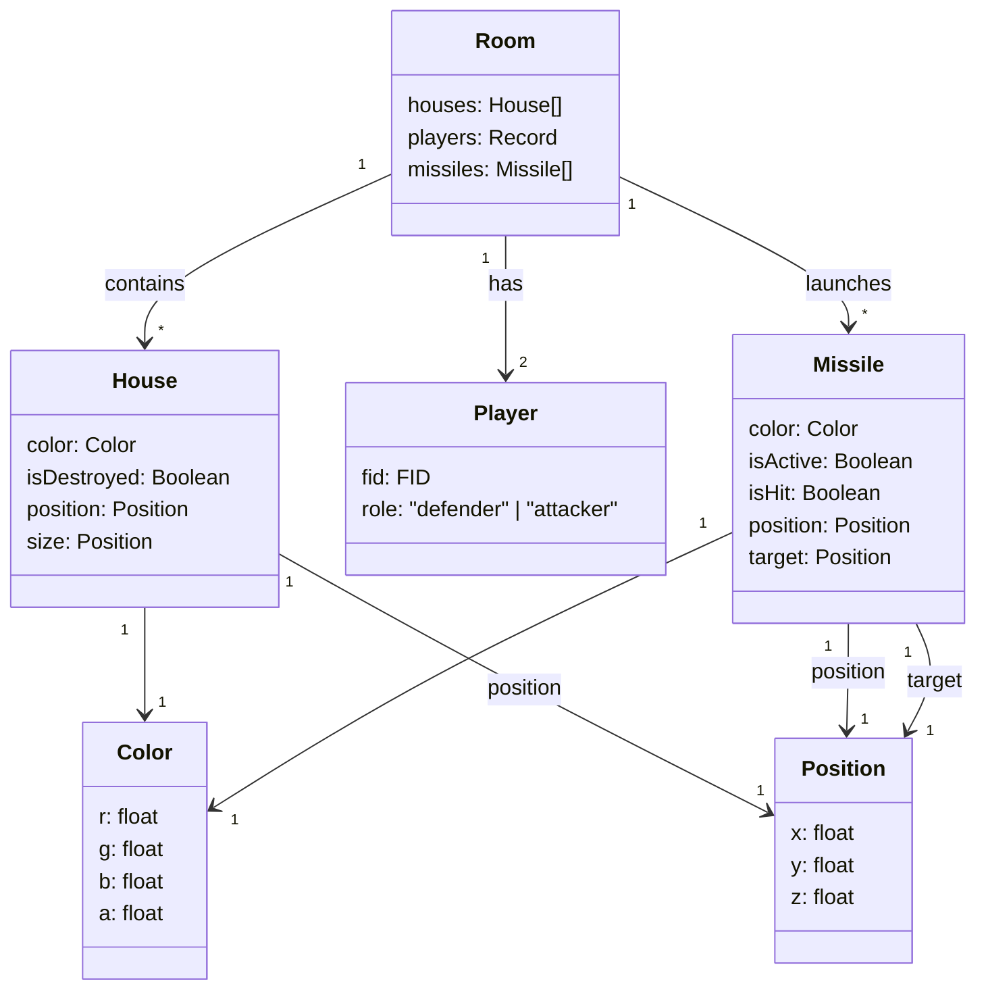

# 🚀 3D Missile Command: Battle Mode (1v1)


Last year, I created a [3D Missile Command game](/plan/2024/12/06/week-48-ecs) using **p5.js** for my *Digital Graphics* class. This time, for the **Game AI** class, I decided to upgrade it into a **1v1 Battle version** ⚔️.  

However, since p5.js is essentially a subset of the Processing language, extending the project came with limitations from both Processing and JavaScript. So I decided to **rebuild it entirely in Babylon.js** 🧱.

Thanks to the **ECS paradigm** and **Cursor**, the transition from p5.js to Babylon.js wasn’t too painful. I started with [Babylon’s webpack example](https://github.com/RaananW/babylonjs-webpack-es6) and swapped the bundler to **Rspack** ⚙️.

The AI assistant (Sonnet 3.5) got stuck handling mouse events 🐭. In the original p5.js version, I had to implement raycasting myself, but Babylon.js provides raycasting natively — so some manual adjustment was needed.

🎮 **Play the remake here:** [missile-command.netlify.app](https://missile-command.netlify.app/)

---

## 🛡️ Defender Mode

The original *Missile Command* is all about defense — the player marks laser targets to protect cities from incoming missiles.  


I kept most of the defense logic the same. The player simply **long-clicks on the ground** to set the target location. Simple, classic, and satisfying 💥.

---

## ☄️ Attacker Mode

Now comes the twist — the **Attacker** 😈.  
I added a sky area in the game so the attacker can **click positions to launch missiles** toward the defender’s cities.


This turns the game into a tense 1v1 showdown — one defends, one destroys.

---

## 🗄️ Data & Storage

At first, I used **LocalStorage** for quick prototyping 🧩. Later, I refactored everything with **Cursor** to use **Firebase Realtime Database** 🔥 for proper multiplayer sync.

Here’s how it works:
- When **Player 1** starts a game, a **6-digit room hash** is generated in the URL.
- **Player 2** joins using that same URL — they automatically become the **Attacker**.
- Any other players joining the same link will be blocked

| 🛡️ Defender | ☄️ Attacker | 👀 Others |
|--|--|--|
|  |  |  |

---

The data in the Firebase database is structured as follows:  

```graphql
rooms = Record<ID, Room>

Room {
  houses: Houses[]
  players: Record<FID, Players>
  Missiles: Missiles[]
}

House {
 color: Color
 isDestoryed: Boolean
 position: Position
 size: Position
}

Player {
 fid: FID,
 role: "defender" | "attacker"
}

Missile {
 color: Color,
 isActive: Boolean,
 isHit: Boolean,
 position: Position,
 target: position,
}

Color { r g b a }
Position { x, y, z }
```

