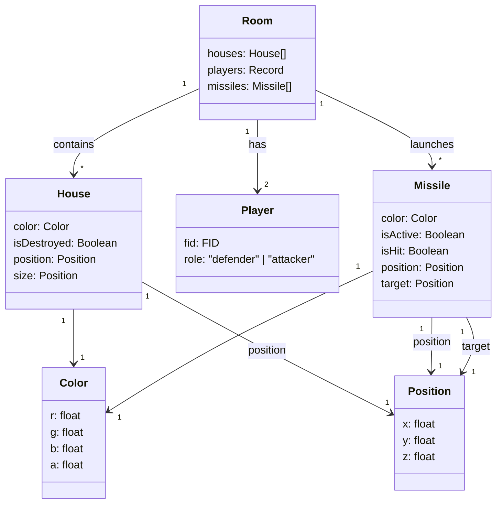

# 🚀 3D Missile Command on Colyseus


Last year, I created a [3D Missile Command game](/plan/2024/12/06/week-48-ecs) using **p5.js** for my *Digital Graphics* class. This time, for the **Game AI** class, I decided to upgrade it into a **1v1 Battle version** ⚔️.  

However, since p5.js is essentially a subset of the Processing language, extending the project came with limitations from both Processing and JavaScript. So I decided to **rebuild it entirely in Babylon.js** 🧱.

Thanks to the **ECS paradigm** and **Cursor**, the transition from p5.js to Babylon.js wasn’t too painful. I started with [Babylon’s webpack example](https://github.com/RaananW/babylonjs-webpack-es6) and swapped the bundler to **Rspack** ⚙️.

The AI assistant (Sonnet 3.5) got stuck handling mouse events 🐭. In the original p5.js version, I had to implement raycasting myself, but Babylon.js provides raycasting natively — so some manual adjustment was needed.

🎮 **Play the remake here:** [missile-command.netlify.app](https://missile-command.netlify.app/)

---

## 🛡️ Defender Mode

The original *Missile Command* is all about defense — the player marks laser targets to protect cities from incoming missiles.  


I kept most of the defense logic the same. The player simply **long-clicks on the ground** to set the target location. Simple, classic, and satisfying 💥.

---

## ☄️ Attacker Mode

Now comes the twist — the **Attacker** 😈.  
I added a sky area in the game so the attacker can **click positions to launch missiles** toward the defender’s cities.


This turns the game into a tense 1v1 showdown — one defends, one destroys.

---

## 🗄️ Data & Storage

At first, I used **LocalStorage** for quick prototyping 🧩. Later, I refactored everything with **Cursor** to use **Firebase Realtime Database** 🔥 for proper multiplayer sync.

Here’s how it works:
- When **Player 1** starts a game, a **6-digit room hash** is generated in the URL.
- **Player 2** joins using that same URL — they automatically become the **Attacker**.
- Any other players joining the same link will be blocked

| 🛡️ Defender | ☄️ Attacker | 👀 Others |
|--|--|--|
|  |  |  |

---

The data in the Firebase database is structured as follows:  

```graphql
rooms = Record<ID, Room>

Room {
  houses: Houses[]
  players: Record<FID, Players>
  Missiles: Missiles[]
}

House {
 color: Color
 isDestoryed: Boolean
 position: Position
 size: Position
}

Player {
 fid: FID,
 role: "defender" | "attacker"
}

Missile {
 color: Color,
 isActive: Boolean,
 isHit: Boolean,
 position: Position,
 target: position,
}

Color { r g b a }
Position { x, y, z }
```


## 🔍 Collision Detection


To place the buildings on the plate, I used random numbers combined with trigonometric functions (`sin`, `cos`) to generate polar coordinates. 🎲
```js
const angle = Math.random() * Math.PI * 2;
const distance = Math.random() * (groundRadius - 5);
const x = Math.cos(angle) * distance;
const z = Math.sin(angle) * distance;
const y = 0;
```

Next, I calculate whether the proposed position is already occupied. For this, I leverage [Yuka](https://mugen87.github.io/yuka/docs/index.html)'s AABB (Axis-Aligned Bounding Box) system:

```ts
function getHouseAABB(position: Vector3, size: Vector3): YukaAABB {
    const points = []
    // Push the 8 corners of the house
    points.push(new YukaVector3(position.x + size.x / 2, position.y + size.y / 2, position.z + size.z / 2));
    /* ... */

    return new YukaAABB().fromPoints(points);
}

function isValidHousePosition(ctx: SceneContext, position: Vector3, size: Vector3): boolean {
    // Keep ground boundary constraint (circular ground with radius 30)
    const distanceFromCenter = Math.sqrt(position.x * position.x + position.z * position.z);
    if (distanceFromCenter + Math.max(size.x, size.z) / 2 > 30) {
        return false;
    }

    const proposedAABB = getHouseAABB(position, size)

    // Test intersection with existing houses (box vs box)
    for (const house of ctx.gameState.houses) {
        const existingAABB = getHouseAABB(house.position, house.size)
        if (proposedAABB.intersectsAABB(existingAABB)) {
            return false;
        }
    }
}
```

## 🚀 Missile's Gravity

The vertical gravity calculation 🌍

$$
v = v + gravity * t \\
dy = v * t
$$

```ts
const gravity = -2;
m.verticalVelocity += gravity * dt;
const dy = m.verticalVelocity * dt;
...
m.position.y += dy; 
````

---

## 🧠 Using Colyseus as Backend

At first, I used **Firebase** as the backend — but the network was too slow 🐢.
So I switched to **Colyseus** ⚡ for a faster, real-time multiplayer backend.

---

### ⚙️ Project Setup

After running into some monorepo headaches 🌀 (the `@colyseus/schema` package didn’t play nicely),
I decided to split it into **two separate projects** instead.

Setting things up took longer than expected ⏳ — so if you’re starting fresh,
it’s better to use the official [Colyseus example project](https://github.com/colyseus/colyseus-examples). ✅

---

### 🧩 Game State

To maintain a **single source of truth** 🧭, all physics are calculated on the **server side**.

Here’s the schema definition 👇

```ts
class GameState extends Schema {
  @type([Player]) players: ArraySchema<Player> = new ArraySchema<Player>();
  @type([House]) houses: ArraySchema<House> = new ArraySchema<House>();
  @type([Missile]) missiles: ArraySchema<Missile> = new ArraySchema<Missile>();
  @type([Laser]) lasers: ArraySchema<Laser> = new ArraySchema<Laser>();
  @type([Marker]) markers: ArraySchema<Marker> = new ArraySchema<Marker>();
  @type("boolean") isGameOver: boolean = false;
}
```

At first, I wanted to use [Babylon’s serializer](https://doc.babylonjs.com/typedoc/classes/BABYLON.SceneSerializer)
to compute the scene server-side and stream it to clients.
However, `@colyseus/schema` requires strict descriptions, so I dropped that plan 🙅‍♂️.

Colyseus provides a handy **`@colyseus/playground`** 🧪 — where you can inspect the entire game state structure visually.

On the client, use `onStateChange` to react to state updates:

```ts
room.onStateChange(handler);
```

You can also use [`getStateCallbacks`](https://docs.colyseus.io/state/callbacks)
to listen to specific value changes 🎯.

---

### 🏠 Game Room

To communicate between client and server, the server listens for the following events 🎮:

| Event Name      | Description                   |
| --------------- | ----------------------------- |
| `spawn_missile` | Attackers spawn missiles      |
| `add_marker`    | Defenders set laser targets   |
| `assign_role`   | Any player chooses their role |

```ts
export class GameRoom extends Room<GameState> {
  state = new GameState();

  onCreate() {
    this.onMessage("spawn_missile", (client, { x, z }) => {...});
    this.onMessage("add_marker", (client, { x, y, z }) => {...});
    this.onMessage("assign_role", (client, { role }) => {...});
    this.initializeScene();
    this.setSimulationInterval((deltaTime) => this.update(deltaTime), 50);
  }

  onJoin(client, options) {...}
  onLeave(client) {...}
  onDispose() {...}
}
```

Client-side event sending example 📡:

```ts
function getClient(): Client {
  if (!client) {
    const server = process.env.SERVER || "ws://localhost:2567";
    client = new Client(server);
  }
  return client;
}

async function getRoom(): Promise<Room> {
  if (!roomPromise) {
    const client = getClient();
    const roomName = "missile_command";
    const connect = (opts?: Record<string, unknown>) =>
      client.joinOrCreate(roomName, opts).catch(async () => {
        try {
          return await client.create(roomName, opts);
        } catch {
          return await client.join(roomName, opts);
        }
      });
    roomPromise = connect();
  }
  return await roomPromise;
}

// Usage
const room = await getRoom();
room.send("spawn_missile", { x, z });
```

---

## 🕹️ Rules

### 🧨 Attackers

Each missile costs **10 points** 💸 to launch,
but hitting a target earns **100 points** 💥.

```ts
private hitHouse(h: House, attackerSessionId: string): void {
  h.isHit = true;
  h.isDestroyed = true;

  const attacker = this.findPlayer(attackerSessionId);
  if (attacker) attacker.score += 100;
}

private spawnMissile(x: number, z: number, clientSessionId: string): void {
  const attacker = this.findPlayer(clientSessionId);
  if (attacker) attacker.score -= 10;

  const m = new Missile();
  m.position.set(x, 75, z);
  m.target = new Vec3(x, 0, z);
  m.speed = 0; 
  m.verticalVelocity = 0; 
  m.isActive = true; 
  m.isHit = false;
  m.color = { r: Math.random(), g: Math.random(), b: Math.random() };
  m.id = `${Date.now()}-${Math.random().toString(36).slice(2, 8)}`;
  m.clientSessionId = clientSessionId;
  this.state.missiles.push(m);
}
```

### 🛡️ Defenders

Destroying a missile rewards **50 points** ✨.

```ts
private resolveMarkerHit(laserIndex: number, x: number, z: number): void {
  const explosionRadius = 5;
  let destroyedCount = 0;

  for (const m of this.state.missiles) {
    if (!m.isActive) continue;
    const d = Math.hypot(m.position.x - x, m.position.z - z);
    if (d <= explosionRadius) {
      m.isActive = false;
      destroyedCount++;
    }
  }

  const marker = this.state.markers.find(m => !m.isDone && m.assignedLaserIndex === laserIndex);
  if (marker) {
    marker.isDone = true;
    if (destroyedCount > 0) {
      const player = this.findPlayer(marker.clientSessionId);
      if (player) player.score += destroyedCount * 50;
    }
  }
}
```

---

## 🚢 Deployment

🧩 **Open Source Code:** [Missile Command on GitHub](https://github.com/gongbaodd/Missile-Command/tree/babylon)

* **Server:** `/apps/server` — deployed on [Render.com](https://missile-command.onrender.com/) ☁️
* **Client:** `/apps/client` — live on [Netlify](https://missile-command.netlify.app/) 🌐

🎥 **Gameplay Preview:**

<iframe
  src="https://player.cloudinary.com/embed/?cloud_name=dmq8ipket&public_id=missile_command_kjrofc&profile=cld-default"
  width="640"
  height="360" 
  style="height: auto; width: 100%; aspect-ratio: 640 / 360;"
  allow="autoplay; fullscreen; encrypted-media; picture-in-picture"
  allowfullscreen
  frameborder="0"
></iframe>
```
